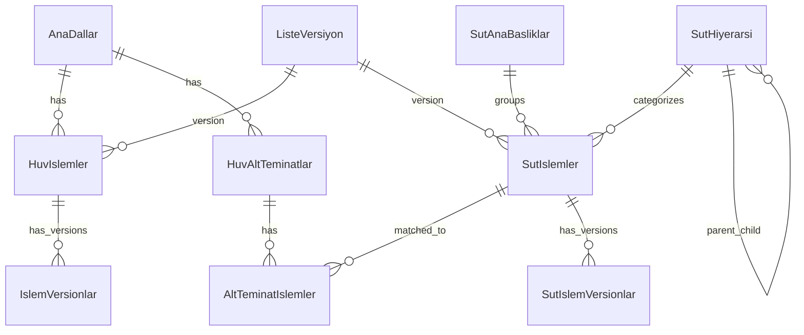

# HUV Projesi - Mimari Dokümantasyon

**Oluşturulma Tarihi:** 12.05.2026

---

## 📋 İçindekiler

1. [Proje Genel Bakış](#proje-genel-bakış)
2. [Teknoloji Stack](#teknoloji-stack)
3. [Proje Yapısı](#proje-yapısı)
4. [Veritabanı Mimarisi](#veritabanı-mimarisi)
5. [API Mimarisi](#api-mimarisi)
6. [Frontend Mimarisi](#frontend-mimarisi)
7. [Güvenlik](#güvenlik)
8. [Performans Optimizasyonları](#performans-optimizasyonları)
9. [Deployment](#deployment)

---

## 🎯 Proje Genel Bakış

HUV (Sağlık Uygulama Tebliği) Projesi, sağlık hizmetleri fiyatlandırma ve SUT (Sağlık Uygulama Tebliği) kodları yönetimi için geliştirilmiş bir web uygulamasıdır.

### Temel Özellikler

- **HUV İşlem Yönetimi**: Sağlık hizmetleri fiyat listesi yönetimi
- **SUT Kod Yönetimi**: SUT kodları ve puanlama sistemi
- **Versiyon Kontrolü**: Tarihsel veri takibi ve karşılaştırma
- **Alt Teminat Eşleştirme**: Otomatik ve manuel eşleştirme sistemi
- **İl Katsayıları**: İl bazlı fiyat katsayıları yönetimi
- **Excel Import/Export**: Toplu veri yükleme ve indirme
- **Audit Trail**: Tüm değişikliklerin kaydı

---

## 🛠️ Teknoloji Stack

### Backend (API)

| Teknoloji | Versiyon | Kullanım Amacı |
|-----------|----------|----------------|
| Node.js | 22.x | Runtime environment |
| Express.js | 5.2.1 | Web framework |
| MS SQL Server | 2022 Express | Veritabanı |
| mssql | 12.2.0 | SQL Server driver |
| JWT | 9.0.3 | Authentication |
| bcrypt | 6.0.0 | Password hashing |
| xlsx | 0.18.5 | Excel işlemleri |
| multer | 1.4.5 | File upload |
| helmet | 8.1.0 | Security headers |
| cors | 2.8.6 | Cross-origin requests |

### Frontend

| Teknoloji | Versiyon | Kullanım Amacı |
|-----------|----------|----------------|
| React | 18.3.1 | UI framework |
| Vite | 6.0.11 | Build tool |
| Material-UI | 6.3.0 | UI components |
| React Router | 7.1.3 | Routing |
| Axios | 1.7.9 | HTTP client |
| React Query | 5.64.2 | Data fetching |
| Zustand | 5.0.2 | State management |

### Development Tools

- **Nodemon**: Auto-restart development server
- **ESLint**: Code linting
- **dotenv**: Environment variables
- **Morgan**: HTTP request logger

---

## 📁 Proje Yapısı

```
HUV/
├── docs/                           # Dokümantasyon
│   ├── PROJE-DOKUMANTASYONU.md    # Proje dokümantasyonu
│   ├── DATABASE-ANALYSIS.md        # Veritabanı analizi
│   ├── API-DOCUMENTATION.md        # API dokümantasyonu
│   ├── ARCHITECTURE.md             # Mimari dokümantasyon
│   └── database-structure.json     # DB yapısı (JSON)
│
├── huv-api/                        # Backend API
│   ├── src/
│   │   ├── config/                 # Konfigürasyon
│   │   │   └── database.js         # DB bağlantı ayarları
│   │   │
│   │   ├── controllers/            # İş mantığı
│   │   │   ├── authController.js
│   │   │   ├── islemController.js
│   │   │   ├── sutController.js
│   │   │   ├── matchingController.js
│   │   │   └── ...
│   │   │
│   │   ├── middleware/             # Middleware'ler
│   │   │   ├── auth.js             # JWT authentication
│   │   │   ├── errorHandler.js     # Error handling
│   │   │   ├── uploadMiddleware.js # File upload
│   │   │   └── importLock.js       # Import kilitleme
│   │   │
│   │   ├── routes/                 # API route'ları
│   │   │   ├── auth.js
│   │   │   ├── islemler.js
│   │   │   ├── sut.js
│   │   │   ├── matching.js
│   │   │   └── ...
│   │   │
│   │   ├── services/               # Servis katmanı
│   │   │   ├── excelParser.js      # Excel parsing
│   │   │   ├── versionManager.js   # Versiyon yönetimi
│   │   │   ├── comparisonService.js # Karşılaştırma
│   │   │   └── matching/           # Eşleştirme servisleri
│   │   │       ├── MatchingEngine.js
│   │   │       ├── DirectSutCodeStrategy.js
│   │   │       └── HierarchyMatchingStrategy.js
│   │   │
│   │   ├── utils/                  # Yardımcı fonksiyonlar
│   │   │   ├── response.js         # Response helpers
│   │   │   ├── cache.js            # Cache yönetimi
│   │   │   ├── dateUtils.js        # Tarih işlemleri
│   │   │   ├── fileCleanup.js      # Dosya temizleme
│   │   │   └── matching/           # Eşleştirme utils
│   │   │
│   │   ├── app.js                  # Express app setup
│   │   └── server.js               # Server başlatma
│   │
│   ├── scripts/                    # Yardımcı scriptler
│   │   ├── db-analyzer.js          # DB analiz scripti
│   │   └── api-doc-generator.js    # API dok. generator
│   │
│   ├── .env                        # Environment variables
│   ├── package.json
│   └── README.md
│
└── huv-frontend/                   # Frontend React App
    ├── src/
    │   ├── api/                    # API client
    │   │   └── axios.js
    │   │
    │   ├── app/                    # App konfigürasyonu
    │   │   ├── config/
    │   │   ├── context/            # React Context
    │   │   ├── providers/          # Context providers
    │   │   └── theme/              # MUI theme
    │   │
    │   ├── components/             # React components
    │   │   ├── common/             # Ortak componentler
    │   │   ├── layout/             # Layout componentleri
    │   │   └── features/           # Feature componentleri
    │   │
    │   ├── pages/                  # Sayfa componentleri
    │   │   ├── Dashboard/
    │   │   ├── Islemler/
    │   │   ├── SUT/
    │   │   ├── Matching/
    │   │   └── ...
    │   │
    │   ├── hooks/                  # Custom React hooks
    │   ├── services/               # Business logic
    │   ├── utils/                  # Utility functions
    │   │
    │   ├── App.jsx                 # Ana component
    │   └── main.jsx                # Entry point
    │
    ├── public/
    ├── index.html
    ├── package.json
    └── vite.config.js
```

---

## 🗄️ Veritabanı Mimarisi

### Veritabanı Özellikleri

- **DBMS**: Microsoft SQL Server 2022 Express
- **Collation**: Turkish_CI_AS (Türkçe karakter desteği)
- **Recovery Model**: SIMPLE
- **Toplam Tablo**: 15
- **Toplam Satır**: ~70,000
- **Toplam Alan**: ~57 MB

### Ana Tablolar

#### 1. HuvIslemler (HUV İşlemleri)
- **Amaç**: Sağlık hizmetleri fiyat listesi
- **Satır Sayısı**: ~8,500
- **Key Fields**: IslemID (PK), HuvKodu, AnaDalKodu (FK)
- **Özellikler**: 
  - Trigger'lar ile audit trail
  - Versiyon kontrolü
  - Alt teminat eşleştirme

#### 2. SutIslemler (SUT İşlemleri)
- **Amaç**: SUT kodları ve puanlama
- **Satır Sayısı**: ~7,100
- **Key Fields**: SutID (PK), SutKodu (Unique), HiyerarsiID (FK)
- **Özellikler**:
  - Hiyerarşik yapı
  - Ana başlık ilişkisi
  - Versiyon kontrolü

#### 3. AltTeminatIslemler (Eşleştirmeler)
- **Amaç**: HUV-SUT eşleştirmeleri
- **Satır Sayısı**: ~4,000
- **Key Fields**: ID (PK), AltTeminatID (FK), SutID (FK)
- **Özellikler**:
  - Confidence score
  - Matching rule type
  - Override mekanizması

#### 4. IslemVersionlar (HUV Tarihsel)
- **Amaç**: HUV işlem geçmişi
- **Satır Sayısı**: ~17,000
- **Key Fields**: VersionID (PK), IslemID (FK)
- **Özellikler**:
  - Geçerlilik tarihleri
  - Değişiklik sebebi
  - Kullanıcı takibi

#### 5. SutIslemVersionlar (SUT Tarihsel)
- **Amaç**: SUT işlem geçmişi
- **Satır Sayısı**: ~7,100
- **Key Fields**: SutVersionID (PK), SutID (FK)

#### 6. IslemAudit (Audit Trail)
- **Amaç**: Tüm değişikliklerin kaydı
- **Satır Sayısı**: ~17,000
- **Özellikler**: Trigger'lar ile otomatik kayıt

### Veritabanı İlişkileri



### Indexler ve Performans

**Toplam Index**: 80+ index
**Index Tipleri**:
- Clustered Index (Primary Keys)
- Non-Clustered Index (Foreign Keys, Search Fields)
- Unique Index (Business Keys)

**Önemli Indexler**:
- `IX_HuvIslemler_HuvKodu`: HUV kodu aramaları
- `IX_SutIslemler_SutKodu`: SUT kodu aramaları
- `IX_AltTeminatIslemler_ConfidenceScore`: Eşleştirme kalitesi
- `IX_IslemVersionlar_IslemID_Aktif`: Tarihsel sorgular

### Stored Procedures

**Toplam SP**: 16

**Önemli SP'ler**:
- `sp_IslemAra`: Gelişmiş arama
- `sp_TarihAraligindaDegişenler`: Değişiklik raporu
- `sp_FiyatDegisimRaporu`: Fiyat değişim analizi
- `sp_SutHiyerarsiGetir`: Hiyerarşik yapı
- `sp_EnPahaliIslemler`: İstatistiksel raporlar

### Views

**Toplam View**: 4

- `vw_IslemArama`: Arama için optimize edilmiş view
- `vw_SutIslemDetay`: SUT detay bilgileri
- `vw_SutAnaBaslikOzet`: Ana başlık özeti
- `vw_SutKategoriOzet`: Kategori istatistikleri

---

## 🔌 API Mimarisi

### Katmanlı Mimari

```
┌─────────────────────────────────────┐
│         Client (Frontend)           │
└─────────────────┬───────────────────┘
                  │ HTTP/REST
┌─────────────────▼───────────────────┐
│         Routes Layer                │
│  (Endpoint tanımları, routing)      │
└─────────────────┬───────────────────┘
                  │
┌─────────────────▼───────────────────┐
│       Middleware Layer              │
│  (Auth, Validation, Error Handle)   │
└─────────────────┬───────────────────┘
                  │
┌─────────────────▼───────────────────┐
│      Controllers Layer              │
│  (Request/Response handling)        │
└─────────────────┬───────────────────┘
                  │
┌─────────────────▼───────────────────┐
│       Services Layer                │
│  (Business logic, algorithms)       │
└─────────────────┬───────────────────┘
                  │
┌─────────────────▼───────────────────┐
│      Database Layer                 │
│  (SQL Server, mssql driver)         │
└─────────────────────────────────────┘
```

### API Endpoint Grupları

**Toplam Endpoint**: 61

1. **Authentication** (3 endpoints)
   - Login, Logout, Token Refresh

2. **HUV İşlemleri** (10 endpoints)
   - CRUD operations
   - Arama ve filtreleme
   - Toplu işlemler

3. **SUT İşlemleri** (10 endpoints)
   - CRUD operations
   - Hiyerarşi yönetimi
   - Arama

4. **Tarihsel** (12 endpoints)
   - HUV tarihsel
   - SUT tarihsel
   - Karşılaştırma

5. **Matching** (6 endpoints)
   - Otomatik eşleştirme
   - Manuel eşleştirme
   - İstatistikler

6. **Import/Export** (9 endpoints)
   - Excel import
   - Excel export
   - Versiyon yönetimi

7. **Alt Teminatlar** (5 endpoints)
   - CRUD operations
   - Eşleştirme yönetimi

8. **External API** (3 endpoints)
   - Dış sistem entegrasyonu

### Middleware'ler

#### 1. Authentication Middleware
```javascript
// JWT token doğrulama
authenticate(req, res, next)

// Admin yetki kontrolü
authorizeAdmin(req, res, next)
```

#### 2. Error Handler Middleware
```javascript
// Global error handling
errorHandler(err, req, res, next)

// 404 handler
notFound(req, res, next)
```

#### 3. Upload Middleware
```javascript
// File upload (multer)
upload.single('file')
upload.array('files', 10)
```

#### 4. Import Lock Middleware
```javascript
// Concurrent import prevention
importLock(req, res, next)
```

### Response Format

**Success Response**:
```json
{
  "success": true,
  "data": { ... },
  "message": "İşlem başarılı"
}
```

**Error Response**:
```json
{
  "success": false,
  "message": "Hata mesajı",
  "error": "Detaylı hata"
}
```

---

## 🎨 Frontend Mimarisi

### Component Yapısı

```
Components
├── Common (Ortak)
│   ├── Button
│   ├── Input
│   ├── Table
│   ├── Modal
│   └── Loading
│
├── Layout
│   ├── Header
│   ├── Sidebar
│   ├── Footer
│   └── MainLayout
│
└── Features (Özellik bazlı)
    ├── Islemler
    ├── SUT
    ├── Matching
    └── Import
```

### State Management

**Zustand Store'lar**:
- `authStore`: Authentication state
- `islemStore`: İşlem verileri
- `sutStore`: SUT verileri
- `matchingStore`: Eşleştirme state

### Routing Yapısı

```
/                       → Dashboard
/login                  → Login Page
/islemler               → HUV İşlemler Listesi
/islemler/:id           → İşlem Detay
/sut                    → SUT Listesi
/sut/:id                → SUT Detay
/matching               → Eşleştirme
/tarihsel               → Tarihsel Veriler
/import                 → Import (Admin)
/admin                  → Admin Panel
```

### Data Fetching

**React Query** kullanımı:
- Automatic caching
- Background refetching
- Optimistic updates
- Pagination support

```javascript
const { data, isLoading, error } = useQuery({
  queryKey: ['islemler', filters],
  queryFn: () => fetchIslemler(filters)
});
```

---

## 🔒 Güvenlik

### Authentication & Authorization

1. **JWT Token Based Auth**
   - Access token (1 saat)
   - Refresh token (7 gün)
   - HttpOnly cookies

2. **Role-Based Access Control (RBAC)**
   - Admin: Tüm yetkiler
   - User: Okuma ve sınırlı yazma

3. **Password Security**
   - bcrypt hashing (10 rounds)
   - Minimum 8 karakter
   - Complexity requirements

### API Security

1. **Helmet.js**
   - Security headers
   - XSS protection
   - Content Security Policy

2. **CORS**
   - Whitelist based
   - Credentials support

3. **Rate Limiting**
   - IP based limiting
   - Endpoint specific limits

4. **Input Validation**
   - SQL injection prevention
   - XSS prevention
   - File upload validation

### Database Security

1. **Parameterized Queries**
   - SQL injection prevention
   - mssql prepared statements

2. **Least Privilege**
   - Application user permissions
   - No direct admin access

3. **Audit Trail**
   - All changes logged
   - User tracking
   - Timestamp recording

---

## ⚡ Performans Optimizasyonları

### Backend Optimizasyonları

1. **Database Connection Pooling**
   ```javascript
   pool: {
     max: 10,
     min: 0,
     idleTimeoutMillis: 30000
   }
   ```

2. **Query Optimization**
   - Indexed columns
   - Stored procedures
   - Views for complex queries

3. **Caching**
   - In-memory cache
   - Cache invalidation
   - TTL based expiry

4. **Batch Processing**
   - Bulk inserts
   - Transaction batching
   - Parallel processing

### Frontend Optimizasyonları

1. **Code Splitting**
   - Route-based splitting
   - Lazy loading
   - Dynamic imports

2. **React Optimization**
   - useMemo, useCallback
   - React.memo
   - Virtual scrolling

3. **Asset Optimization**
   - Image compression
   - Minification
   - Tree shaking

4. **Caching Strategy**
   - React Query cache
   - Service worker
   - Browser cache

---

## 🚀 Deployment

### Development Environment

```bash
# Backend
cd huv-api
npm install
npm run dev

# Frontend
cd huv-frontend
npm install
npm run dev
```

### Production Build

```bash
# Backend
npm start

# Frontend
npm run build
npm run preview
```

### Environment Variables

**Backend (.env)**:
```env
DB_SERVER=localhost
DB_PORT=1433
DB_DATABASE=HuvDB
DB_USER=user
DB_PASSWORD=password
JWT_SECRET=secret
PORT=3000
```

**Frontend (.env)**:
```env
VITE_API_URL=http://localhost:3000/api
```

### Database Setup

1. SQL Server kurulumu
2. Database oluşturma
3. Tablo ve index'lerin oluşturulması
4. Stored procedure'ların yüklenmesi
5. Initial data import

### Monitoring & Logging

1. **Application Logs**
   - Morgan HTTP logger
   - Console logging
   - Error tracking

2. **Database Monitoring**
   - Query performance
   - Connection pool stats
   - Deadlock detection

3. **Health Checks**
   - `/health` endpoint
   - Database connectivity
   - System resources

---

## 📊 Performans Metrikleri

### Backend Metrics

| Metrik | Değer |
|--------|-------|
| Ortalama Response Time | < 100ms |
| Database Query Time | < 50ms |
| Concurrent Users | 50+ |
| Requests/Second | 100+ |

### Frontend Metrics

| Metrik | Değer |
|--------|-------|
| First Contentful Paint | < 1.5s |
| Time to Interactive | < 3s |
| Bundle Size | < 500KB |
| Lighthouse Score | 90+ |

---

## 🔄 Versiyon Kontrolü

### Git Workflow

- **main**: Production branch
- **develop**: Development branch
- **feature/***: Feature branches
- **hotfix/***: Hotfix branches

### Versioning

Semantic Versioning (SemVer):
- MAJOR.MINOR.PATCH
- Örnek: 1.0.0

---

## 📝 Notlar

- Türkçe karakter desteği için Turkish_CI_AS collation kullanılmaktadır
- Tüm tarih/saat değerleri UTC+3 (Türkiye) timezone'unda saklanır
- Excel import/export işlemleri için XLSX formatı kullanılır
- Matching algoritması confidence score bazlıdır (0-100)

---

**Son Güncelleme:** 12.05.2026
**Versiyon:** 1.0.0
