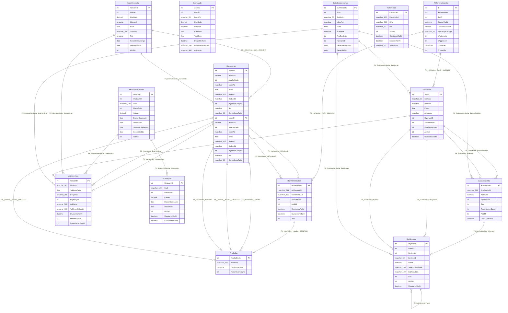

# HuvDB - Veritabanı Dokümantasyonu

**Oluşturulma Tarihi:** 12.05.2026 22:09:07

---

## 📊 Genel Bilgiler

| Özellik | Değer |
|---------|-------|
| Veritabanı Adı | HuvDB |
| SQL Server Versiyonu | 16.0.1000.6 |
| Edition | Express Edition (64-bit) |
| Collation | Turkish_CI_AS |
| Recovery Model | SIMPLE |
| Durum | ONLINE |

## 📈 İstatistikler

| Metrik | Değer |
|--------|-------|
| Toplam Tablo Sayısı | 15 |
| Veri İçeren Tablolar | 15 |
| Boş Tablolar | 0 |
| Toplam Satır Sayısı | 70.330 |
| Toplam Alan (MB) | 57.02 MB |
| View Sayısı | 4 |
| Stored Procedure Sayısı | 16 |
| Function Sayısı | 0 |

## 📋 Tablolar

### Tablo Özeti

| Tablo Adı | Satır Sayısı | Alan (MB) | Kolon Sayısı | PK | FK |
|-----------|--------------|-----------|--------------|----|----|
| AltTeminatIslemler | 3.991 | 1.62 | 18 | ✓ | 2 |
| AnaDallar | 34 | 0.13 | 4 | ✓ | 0 |
| HuvAltTeminatlar | 333 | 0.41 | 8 | ✓ | 1 |
| HuvIslemler | 8.085 | 0.26 | 17 | ✓ | 4 |
| HuvIslemler | 8.594 | 12.82 | 17 | ✓ | 4 |
| IlKatsayilari | 81 | 0.14 | 9 | ✓ | 0 |
| IlKatsayiVersionlar | 162 | 0.21 | 14 | ✓ | 2 |
| IslemAudit | 17.191 | 5.53 | 10 | ✓ | 0 |
| IslemVersionlar | 17.185 | 23.88 | 14 | ✓ | 3 |
| Kullanicilar | 2 | 0.14 | 8 | ✓ | 0 |
| ListeVersiyon | 6 | 0.21 | 11 | ✓ | 0 |
| SutAnaBasliklar | 10 | 0.28 | 8 | ✓ | 1 |
| SutHiyerarsi | 390 | 0.35 | 10 | ✓ | 1 |
| SutIslemler | 7.130 | 5.24 | 11 | ✓ | 5 |
| SutIslemVersionlar | 7.136 | 5.80 | 15 | ✓ | 4 |

### 📄 AltTeminatIslemler

**Schema:** dbo  
**Satır Sayısı:** 3.991  
**Kullanılan Alan:** 1.41 MB  

#### Kolonlar

| Kolon Adı | Veri Tipi | Nullable | Default | Identity | Computed |
|-----------|-----------|----------|---------|----------|----------|
| ID | int(10) | ✗ | - | ✓ | ✗ |
| AltTeminatID | int(10) | ✗ | - | ✗ | ✗ |
| SutID | int(10) | ✗ | - | ✗ | ✗ |
| EklemeTarihi | datetime | ✓ | (getdate()) | ✗ | ✗ |
| ConfidenceScore | decimal(5,2) | ✓ | - | ✗ | ✗ |
| MatchingRuleType | nvarchar(50) | ✓ | - | ✗ | ✗ |
| IsAutomatic | bit | ✓ | ((1)) | ✗ | ✗ |
| IsApproved | bit | ✓ | ((0)) | ✗ | ✗ |
| CreatedAt | datetime2 | ✓ | (getdate()) | ✗ | ✗ |
| CreatedBy | int(10) | ✓ | - | ✗ | ✗ |
| UpdatedAt | datetime2 | ✓ | - | ✗ | ✗ |
| UpdatedBy | int(10) | ✓ | - | ✗ | ✗ |
| IsOverridden | bit | ✓ | ((0)) | ✗ | ✗ |
| OriginalAltTeminatID | int(10) | ✓ | - | ✗ | ✗ |
| OriginalConfidenceScore | decimal(5,2) | ✓ | - | ✗ | ✗ |
| OriginalRuleType | nvarchar(50) | ✓ | - | ✗ | ✗ |
| OverriddenAt | datetime2 | ✓ | - | ✗ | ✗ |
| OverriddenBy | int(10) | ✓ | - | ✗ | ✗ |

#### Primary Key

**Constraint:** PK__AltTemin__3214EC275EB51ECF  
**Kolonlar:** ID  

#### Foreign Keys

| FK Adı | Kolon | Referans Tablo | Referans Kolon | Delete | Update |
|--------|-------|----------------|----------------|--------|--------|
| FK__AltTemina__SutID__0307610B | SutID | SutIslemler | SutID | NO_ACTION | NO_ACTION |
| FK__AltTemina__AltTe__02133CD2 | AltTeminatID | HuvAltTeminatlar | AltTeminatID | NO_ACTION | NO_ACTION |

#### Indexler

| Index Adı | Tip | Unique | Kolonlar |
|-----------|-----|--------|----------|
| IX_AltTeminatIslemler_ConfidenceScore | NONCLUSTERED | ✗ | ConfidenceScore |
| IX_AltTeminatIslemler_IsApproved | NONCLUSTERED | ✗ | IsApproved |
| IX_AltTeminatIslemler_IsOverridden | NONCLUSTERED | ✗ | IsOverridden |
| IX_AltTeminatIslemler_MatchingRuleType | NONCLUSTERED | ✗ | MatchingRuleType |
| IX_AltTeminatIslemler_SutID | NONCLUSTERED | ✗ | SutID |
| PK__AltTemin__3214EC275EB51ECF | CLUSTERED | ✓ | ID |
| UQ_AltTeminatIslemler_SutID | NONCLUSTERED | ✓ | SutID |

---

### 📄 AnaDallar

**Schema:** dbo  
**Satır Sayısı:** 34  
**Kullanılan Alan:** 0.03 MB  

#### Kolonlar

| Kolon Adı | Veri Tipi | Nullable | Default | Identity | Computed |
|-----------|-----------|----------|---------|----------|----------|
| AnaDalKodu | int(10) | ✗ | - | ✗ | ✗ |
| BolumAdi | nvarchar(200) | ✗ | - | ✗ | ✗ |
| OlusturmaTarihi | datetime | ✓ | (getdate()) | ✗ | ✗ |
| ToplamIslemSayisi | int(10) | ✓ | - | ✗ | ✗ |

#### Primary Key

**Constraint:** PK__AnaDalla__97F720920BFB60AB  
**Kolonlar:** AnaDalKodu  

#### Indexler

| Index Adı | Tip | Unique | Kolonlar |
|-----------|-----|--------|----------|
| PK__AnaDalla__97F720920BFB60AB | CLUSTERED | ✓ | AnaDalKodu |

---

### 📄 HuvAltTeminatlar

**Schema:** dbo  
**Satır Sayısı:** 333  
**Kullanılan Alan:** 0.20 MB  

#### Kolonlar

| Kolon Adı | Veri Tipi | Nullable | Default | Identity | Computed |
|-----------|-----------|----------|---------|----------|----------|
| AltTeminatID | int(10) | ✗ | - | ✓ | ✗ |
| AltTeminatAdi | nvarchar(255) | ✗ | - | ✗ | ✗ |
| UstTeminatAdi | nvarchar(255) | ✗ | - | ✗ | ✗ |
| AnaDalKodu | int(10) | ✗ | - | ✗ | ✗ |
| AktifMi | bit | ✓ | ((1)) | ✗ | ✗ |
| OlusturmaTarihi | datetime | ✓ | (getdate()) | ✗ | ✗ |
| GuncellemeTarihi | datetime | ✓ | - | ✗ | ✗ |
| Sira | int(10) | ✓ | - | ✗ | ✗ |

#### Primary Key

**Constraint:** PK__HuvAltTe__012F3FA974DA0AC8  
**Kolonlar:** AltTeminatID  

#### Foreign Keys

| FK Adı | Kolon | Referans Tablo | Referans Kolon | Delete | Update |
|--------|-------|----------------|----------------|--------|--------|
| FK__HuvAltTem__AnaDa__6C23FBB3 | AnaDalKodu | AnaDallar | AnaDalKodu | NO_ACTION | NO_ACTION |

#### Indexler

| Index Adı | Tip | Unique | Kolonlar |
|-----------|-----|--------|----------|
| IX_HuvAltTeminatlar_AktifMi | NONCLUSTERED | ✗ | AktifMi |
| IX_HuvAltTeminatlar_AnaDalKodu | NONCLUSTERED | ✗ | AnaDalKodu |
| IX_HuvAltTeminatlar_Sira | NONCLUSTERED | ✗ | Sira |
| PK__HuvAltTe__012F3FA974DA0AC8 | CLUSTERED | ✓ | AltTeminatID |
| UQ_HuvAltTeminat | NONCLUSTERED | ✓ | AnaDalKodu, UstTeminatAdi, AltTeminatAdi |

---

### 📄 HuvIslemler

**Schema:** dbo  
**Satır Sayısı:** 8.085  
**Kullanılan Alan:** 0.26 MB  

#### Kolonlar

| Kolon Adı | Veri Tipi | Nullable | Default | Identity | Computed |
|-----------|-----------|----------|---------|----------|----------|
| IslemID | int(10) | ✗ | - | ✗ | ✗ |
| HuvKodu | decimal(10,5) | ✗ | - | ✗ | ✗ |
| AnaDalKodu | int(10) | ✓ | - | ✗ | ✗ |
| IslemAdi | nvarchar | ✓ | - | ✗ | ✗ |
| Birim | float(53) | ✓ | - | ✗ | ✗ |
| SutKodu | nvarchar(100) | ✓ | - | ✗ | ✗ |
| UstBaslik | nvarchar | ✓ | - | ✗ | ✗ |
| HiyerarsiSeviyesi | int(10) | ✓ | - | ✗ | ✗ |
| Not | nvarchar | ✓ | - | ✗ | ✗ |
| GuncellemeTarihi | nvarchar(50) | ✓ | - | ✗ | ✗ |
| EklemeTarihi | nvarchar(50) | ✓ | - | ✗ | ✗ |
| GuncellemeTarihiDate | date | ✓ | - | ✗ | ✗ |
| EklemeTarihiDate | date | ✓ | - | ✗ | ✗ |
| ListeVersiyonID | int(10) | ✓ | - | ✗ | ✗ |
| ListeTipi | nvarchar(50) | ✓ | ('HUV') | ✗ | ✗ |
| AktifMi | bit | ✗ | ((1)) | ✗ | ✗ |
| AltTeminatID | int(10) | ✓ | - | ✗ | ✗ |

#### Primary Key

**Constraint:** PK__Islemler__246DE2BB3D0F9E15  
**Kolonlar:** IslemID  

#### Foreign Keys

| FK Adı | Kolon | Referans Tablo | Referans Kolon | Delete | Update |
|--------|-------|----------------|----------------|--------|--------|
| FK_HuvIslemler_ListeVersiyon | ListeVersiyonID | ListeVersiyon | VersionID | NO_ACTION | NO_ACTION |
| FK_HuvIslemler_AnaDallar | AnaDalKodu | AnaDallar | AnaDalKodu | NO_ACTION | NO_ACTION |
| FK__Islemler__AnaDal__5DCAEF64 | AnaDalKodu | AnaDallar | AnaDalKodu | NO_ACTION | NO_ACTION |
| FK_HuvIslemler_AltTeminatID | AltTeminatID | HuvAltTeminatlar | AltTeminatID | NO_ACTION | NO_ACTION |

#### Indexler

| Index Adı | Tip | Unique | Kolonlar |
|-----------|-----|--------|----------|
| IX_HuvIslemler_AktifMi | NONCLUSTERED | ✗ | AktifMi |
| IX_HuvIslemler_AnaDalKodu | NONCLUSTERED | ✗ | AnaDalKodu |
| IX_HuvIslemler_Birim | NONCLUSTERED | ✗ | Birim |
| IX_HuvIslemler_EklemeTarihiDate | NONCLUSTERED | ✗ | EklemeTarihiDate |
| IX_HuvIslemler_GuncellemeTarihi | NONCLUSTERED | ✗ | GuncellemeTarihi |
| IX_HuvIslemler_HuvKodu | NONCLUSTERED | ✗ | HuvKodu |
| IX_HuvIslemler_ListeTipi | NONCLUSTERED | ✗ | ListeTipi |
| IX_HuvIslemler_ListeVersiyonID | NONCLUSTERED | ✗ | ListeVersiyonID |
| PK__Islemler__246DE2BB3D0F9E15 | CLUSTERED | ✓ | IslemID |

#### Trigger'lar

| Trigger Adı | Olaylar | Aktif |
|-------------|---------|-------|
| TR_Islemler_Update_Audit | UPDATE | ✓ |
| TR_Islemler_Insert_Audit | INSERT | ✓ |
| TR_Islemler_Delete_Audit | DELETE | ✓ |

---

### 📄 HuvIslemler

**Schema:** dbo  
**Satır Sayısı:** 8.594  
**Kullanılan Alan:** 12.58 MB  

#### Kolonlar

| Kolon Adı | Veri Tipi | Nullable | Default | Identity | Computed |
|-----------|-----------|----------|---------|----------|----------|
| IslemID | int(10) | ✗ | - | ✗ | ✗ |
| HuvKodu | decimal(10,5) | ✗ | - | ✗ | ✗ |
| AnaDalKodu | int(10) | ✓ | - | ✗ | ✗ |
| IslemAdi | nvarchar | ✓ | - | ✗ | ✗ |
| Birim | float(53) | ✓ | - | ✗ | ✗ |
| SutKodu | nvarchar(100) | ✓ | - | ✗ | ✗ |
| UstBaslik | nvarchar | ✓ | - | ✗ | ✗ |
| HiyerarsiSeviyesi | int(10) | ✓ | - | ✗ | ✗ |
| Not | nvarchar | ✓ | - | ✗ | ✗ |
| GuncellemeTarihi | nvarchar(50) | ✓ | - | ✗ | ✗ |
| EklemeTarihi | nvarchar(50) | ✓ | - | ✗ | ✗ |
| GuncellemeTarihiDate | date | ✓ | - | ✗ | ✗ |
| EklemeTarihiDate | date | ✓ | - | ✗ | ✗ |
| ListeVersiyonID | int(10) | ✓ | - | ✗ | ✗ |
| ListeTipi | nvarchar(50) | ✓ | ('HUV') | ✗ | ✗ |
| AktifMi | bit | ✗ | ((1)) | ✗ | ✗ |
| AltTeminatID | int(10) | ✓ | - | ✗ | ✗ |

#### Primary Key

**Constraint:** PK__Islemler__246DE2BB3D0F9E15  
**Kolonlar:** IslemID  

#### Foreign Keys

| FK Adı | Kolon | Referans Tablo | Referans Kolon | Delete | Update |
|--------|-------|----------------|----------------|--------|--------|
| FK_HuvIslemler_ListeVersiyon | ListeVersiyonID | ListeVersiyon | VersionID | NO_ACTION | NO_ACTION |
| FK_HuvIslemler_AnaDallar | AnaDalKodu | AnaDallar | AnaDalKodu | NO_ACTION | NO_ACTION |
| FK__Islemler__AnaDal__5DCAEF64 | AnaDalKodu | AnaDallar | AnaDalKodu | NO_ACTION | NO_ACTION |
| FK_HuvIslemler_AltTeminatID | AltTeminatID | HuvAltTeminatlar | AltTeminatID | NO_ACTION | NO_ACTION |

#### Indexler

| Index Adı | Tip | Unique | Kolonlar |
|-----------|-----|--------|----------|
| IX_HuvIslemler_AktifMi | NONCLUSTERED | ✗ | AktifMi |
| IX_HuvIslemler_AnaDalKodu | NONCLUSTERED | ✗ | AnaDalKodu |
| IX_HuvIslemler_Birim | NONCLUSTERED | ✗ | Birim |
| IX_HuvIslemler_EklemeTarihiDate | NONCLUSTERED | ✗ | EklemeTarihiDate |
| IX_HuvIslemler_GuncellemeTarihi | NONCLUSTERED | ✗ | GuncellemeTarihi |
| IX_HuvIslemler_HuvKodu | NONCLUSTERED | ✗ | HuvKodu |
| IX_HuvIslemler_ListeTipi | NONCLUSTERED | ✗ | ListeTipi |
| IX_HuvIslemler_ListeVersiyonID | NONCLUSTERED | ✗ | ListeVersiyonID |
| PK__Islemler__246DE2BB3D0F9E15 | CLUSTERED | ✓ | IslemID |

#### Trigger'lar

| Trigger Adı | Olaylar | Aktif |
|-------------|---------|-------|
| TR_Islemler_Update_Audit | UPDATE | ✓ |
| TR_Islemler_Insert_Audit | INSERT | ✓ |
| TR_Islemler_Delete_Audit | DELETE | ✓ |

---

### 📄 IlKatsayilari

**Schema:** dbo  
**Satır Sayısı:** 81  
**Kullanılan Alan:** 0.03 MB  

#### Kolonlar

| Kolon Adı | Veri Tipi | Nullable | Default | Identity | Computed |
|-----------|-----------|----------|---------|----------|----------|
| IlKatsayiID | int(10) | ✗ | - | ✓ | ✗ |
| IlAdi | nvarchar(100) | ✗ | - | ✗ | ✗ |
| PlakaKodu | int(10) | ✓ | - | ✗ | ✗ |
| Katsayi | decimal(18,2) | ✗ | - | ✗ | ✗ |
| DonemBaslangic | date | ✓ | - | ✗ | ✗ |
| DonemBitis | date | ✓ | - | ✗ | ✗ |
| AktifMi | bit | ✗ | ((1)) | ✗ | ✗ |
| OlusturmaTarihi | datetime | ✗ | (getdate()) | ✗ | ✗ |
| GuncellemeTarihi | datetime | ✓ | - | ✗ | ✗ |

#### Primary Key

**Constraint:** PK_IlKatsayilari  
**Kolonlar:** IlKatsayiID  

#### Indexler

| Index Adı | Tip | Unique | Kolonlar |
|-----------|-----|--------|----------|
| IX_IlKatsayilari_IlAdi_Aktif | NONCLUSTERED | ✓ | IlAdi |
| PK_IlKatsayilari | CLUSTERED | ✓ | IlKatsayiID |

---

### 📄 IlKatsayiVersionlar

**Schema:** dbo  
**Satır Sayısı:** 162  
**Kullanılan Alan:** 0.08 MB  

#### Kolonlar

| Kolon Adı | Veri Tipi | Nullable | Default | Identity | Computed |
|-----------|-----------|----------|---------|----------|----------|
| VersionID | int(10) | ✗ | - | ✓ | ✗ |
| IlKatsayiID | int(10) | ✗ | - | ✗ | ✗ |
| IlAdi | nvarchar(100) | ✗ | - | ✗ | ✗ |
| PlakaKodu | int(10) | ✓ | - | ✗ | ✗ |
| Katsayi | decimal(18,2) | ✗ | - | ✗ | ✗ |
| DonemBaslangic | date | ✓ | - | ✗ | ✗ |
| DonemBitis | date | ✓ | - | ✗ | ✗ |
| GecerlilikBaslangic | date | ✗ | - | ✗ | ✗ |
| GecerlilikBitis | date | ✓ | - | ✗ | ✗ |
| AktifMi | bit | ✗ | - | ✗ | ✗ |
| ListeVersiyonID | int(10) | ✓ | - | ✗ | ✗ |
| DegisiklikSebebi | nvarchar(500) | ✓ | - | ✗ | ✗ |
| OlusturanKullanici | nvarchar(100) | ✓ | - | ✗ | ✗ |
| OlusturmaTarihi | datetime | ✗ | (getdate()) | ✗ | ✗ |

#### Primary Key

**Constraint:** PK_IlKatsayiVersionlar  
**Kolonlar:** VersionID  

#### Foreign Keys

| FK Adı | Kolon | Referans Tablo | Referans Kolon | Delete | Update |
|--------|-------|----------------|----------------|--------|--------|
| FK_IlKatsayiVersionlar_ListeVersiyon | ListeVersiyonID | ListeVersiyon | VersionID | NO_ACTION | NO_ACTION |
| FK_IlKatsayiVersionlar_IlKatsayilari | IlKatsayiID | IlKatsayilari | IlKatsayiID | NO_ACTION | NO_ACTION |

#### Indexler

| Index Adı | Tip | Unique | Kolonlar |
|-----------|-----|--------|----------|
| IX_IlKatsayiVersionlar_Aktif | NONCLUSTERED | ✗ | IlKatsayiID, AktifMi, GecerlilikBitis |
| IX_IlKatsayiVersionlar_ListeVersiyonID | NONCLUSTERED | ✗ | ListeVersiyonID |
| PK_IlKatsayiVersionlar | CLUSTERED | ✓ | VersionID |

---

### 📄 IslemAudit

**Schema:** dbo  
**Satır Sayısı:** 17.191  
**Kullanılan Alan:** 5.30 MB  

#### Kolonlar

| Kolon Adı | Veri Tipi | Nullable | Default | Identity | Computed |
|-----------|-----------|----------|---------|----------|----------|
| AuditID | int(10) | ✗ | - | ✓ | ✗ |
| IslemID | int(10) | ✗ | - | ✗ | ✗ |
| IslemTipi | nvarchar(20) | ✗ | - | ✗ | ✗ |
| HuvKodu | decimal(10,5) | ✓ | - | ✗ | ✗ |
| IslemAdi | nvarchar | ✓ | - | ✗ | ✗ |
| EskiBirim | float(53) | ✓ | - | ✗ | ✗ |
| YeniBirim | float(53) | ✓ | - | ✗ | ✗ |
| DegisiklikTarihi | datetime | ✓ | (getdate()) | ✗ | ✗ |
| DegistirenKullanici | nvarchar(100) | ✓ | (suser_sname()) | ✗ | ✗ |
| Aciklama | nvarchar(500) | ✓ | - | ✗ | ✗ |

#### Primary Key

**Constraint:** PK__IslemAud__A17F23B88D52CBBA  
**Kolonlar:** AuditID  

#### Indexler

| Index Adı | Tip | Unique | Kolonlar |
|-----------|-----|--------|----------|
| IX_IslemAudit_DegisiklikTarihi | NONCLUSTERED | ✗ | DegisiklikTarihi |
| IX_IslemAudit_IslemID | NONCLUSTERED | ✗ | IslemID |
| IX_IslemAudit_IslemTipi | NONCLUSTERED | ✗ | IslemTipi |
| PK__IslemAud__A17F23B88D52CBBA | CLUSTERED | ✓ | AuditID |

---

### 📄 IslemVersionlar

**Schema:** dbo  
**Satır Sayısı:** 17.185  
**Kullanılan Alan:** 23.55 MB  

#### Kolonlar

| Kolon Adı | Veri Tipi | Nullable | Default | Identity | Computed |
|-----------|-----------|----------|---------|----------|----------|
| VersionID | int(10) | ✗ | - | ✓ | ✗ |
| IslemID | int(10) | ✗ | - | ✗ | ✗ |
| HuvKodu | decimal(10,5) | ✗ | - | ✗ | ✗ |
| IslemAdi | nvarchar | ✓ | - | ✗ | ✗ |
| Birim | float(53) | ✓ | - | ✗ | ✗ |
| SutKodu | nvarchar(100) | ✓ | - | ✗ | ✗ |
| Not | nvarchar | ✓ | - | ✗ | ✗ |
| GecerlilikBaslangic | date | ✗ | - | ✗ | ✗ |
| GecerlilikBitis | date | ✓ | - | ✗ | ✗ |
| AktifMi | bit | ✓ | ((1)) | ✗ | ✗ |
| OlusturanKullanici | nvarchar(100) | ✓ | (suser_sname()) | ✗ | ✗ |
| OlusturmaTarihi | datetime | ✓ | (getdate()) | ✗ | ✗ |
| DegisiklikSebebi | nvarchar(500) | ✓ | - | ✗ | ✗ |
| ListeVersiyonID | int(10) | ✓ | - | ✗ | ✗ |

#### Primary Key

**Constraint:** PK__IslemVer__16C6402FC2A8348F  
**Kolonlar:** VersionID  

#### Foreign Keys

| FK Adı | Kolon | Referans Tablo | Referans Kolon | Delete | Update |
|--------|-------|----------------|----------------|--------|--------|
| FK_IslemVersionlar_ListeVersiyon | ListeVersiyonID | ListeVersiyon | VersionID | NO_ACTION | NO_ACTION |
| FK__IslemVers__Islem__08B54D69 | IslemID | HuvIslemler | IslemID | NO_ACTION | NO_ACTION |
| FK_IslemVersionlar_HuvIslemler | IslemID | HuvIslemler | IslemID | NO_ACTION | NO_ACTION |

#### Indexler

| Index Adı | Tip | Unique | Kolonlar |
|-----------|-----|--------|----------|
| IX_IslemVersionlar_AktifMi | NONCLUSTERED | ✗ | AktifMi |
| IX_IslemVersionlar_GecerlilikBaslangic | NONCLUSTERED | ✗ | GecerlilikBaslangic |
| IX_IslemVersionlar_HuvKodu | NONCLUSTERED | ✗ | HuvKodu |
| IX_IslemVersionlar_IslemID | NONCLUSTERED | ✗ | IslemID |
| IX_IslemVersionlar_IslemID_Aktif | NONCLUSTERED | ✗ | GecerlilikBaslangic, GecerlilikBitis, IslemID, AktifMi |
| IX_IslemVersionlar_ListeVersiyonID | NONCLUSTERED | ✗ | ListeVersiyonID |
| PK__IslemVer__16C6402FC2A8348F | CLUSTERED | ✓ | VersionID |

---

### 📄 Kullanicilar

**Schema:** dbo  
**Satır Sayısı:** 2  
**Kullanılan Alan:** 0.03 MB  

#### Kolonlar

| Kolon Adı | Veri Tipi | Nullable | Default | Identity | Computed |
|-----------|-----------|----------|---------|----------|----------|
| KullaniciID | int(10) | ✗ | - | ✓ | ✗ |
| KullaniciAdi | nvarchar(100) | ✗ | - | ✗ | ✗ |
| Sifre | nvarchar(255) | ✗ | - | ✗ | ✗ |
| Rol | nvarchar(20) | ✗ | - | ✗ | ✗ |
| AktifMi | bit | ✗ | ((1)) | ✗ | ✗ |
| OlusturmaTarihi | datetime | ✗ | (getdate()) | ✗ | ✗ |
| SonGirisTarihi | datetime | ✓ | - | ✗ | ✗ |
| SonGirisIP | nvarchar(50) | ✓ | - | ✗ | ✗ |

#### Primary Key

**Constraint:** PK_Kullanicilar  
**Kolonlar:** KullaniciID  

#### Indexler

| Index Adı | Tip | Unique | Kolonlar |
|-----------|-----|--------|----------|
| PK_Kullanicilar | CLUSTERED | ✓ | KullaniciID |
| UQ_Kullanicilar_KullaniciAdi | NONCLUSTERED | ✓ | KullaniciAdi |

---

### 📄 ListeVersiyon

**Schema:** dbo  
**Satır Sayısı:** 6  
**Kullanılan Alan:** 0.05 MB  

#### Kolonlar

| Kolon Adı | Veri Tipi | Nullable | Default | Identity | Computed |
|-----------|-----------|----------|---------|----------|----------|
| VersionID | int(10) | ✗ | - | ✓ | ✗ |
| ListeTipi | nvarchar(50) | ✗ | ('HUV') | ✗ | ✗ |
| YuklemeTarihi | date | ✗ | - | ✗ | ✗ |
| DosyaAdi | nvarchar(255) | ✓ | - | ✗ | ✗ |
| KayitSayisi | int(10) | ✓ | - | ✗ | ✗ |
| Aciklama | nvarchar(500) | ✓ | - | ✗ | ✗ |
| YukleyenKullanici | nvarchar(100) | ✓ | - | ✗ | ✗ |
| OlusturmaTarihi | datetime | ✗ | (getdate()) | ✗ | ✗ |
| EklenenSayisi | int(10) | ✓ | - | ✗ | ✗ |
| GuncellenenSayisi | int(10) | ✓ | - | ✗ | ✗ |
| SilinenSayisi | int(10) | ✓ | - | ✗ | ✗ |

#### Primary Key

**Constraint:** PK_ListeVersiyon  
**Kolonlar:** VersionID  

#### Indexler

| Index Adı | Tip | Unique | Kolonlar |
|-----------|-----|--------|----------|
| IX_ListeVersiyon_ListeTipi | NONCLUSTERED | ✗ | YuklemeTarihi, ListeTipi |
| IX_ListeVersiyon_YuklemeTarihi | NONCLUSTERED | ✗ | YuklemeTarihi |
| PK_ListeVersiyon | CLUSTERED | ✓ | VersionID |

---

### 📄 SutAnaBasliklar

**Schema:** dbo  
**Satır Sayısı:** 10  
**Kullanılan Alan:** 0.06 MB  

#### Kolonlar

| Kolon Adı | Veri Tipi | Nullable | Default | Identity | Computed |
|-----------|-----------|----------|---------|----------|----------|
| AnaBaslikNo | int(10) | ✗ | - | ✗ | ✗ |
| AnaBaslikAdi | nvarchar(500) | ✗ | - | ✗ | ✗ |
| Aciklama | nvarchar | ✓ | - | ✗ | ✗ |
| HiyerarsiID | int(10) | ✓ | - | ✗ | ✗ |
| Sira | int(10) | ✓ | - | ✗ | ✗ |
| ToplamIslemSayisi | int(10) | ✓ | - | ✗ | ✗ |
| AktifMi | bit | ✗ | ((1)) | ✗ | ✗ |
| OlusturmaTarihi | datetime | ✗ | (getdate()) | ✗ | ✗ |

#### Primary Key

**Constraint:** PK_SutAnaBasliklar  
**Kolonlar:** AnaBaslikNo  

#### Foreign Keys

| FK Adı | Kolon | Referans Tablo | Referans Kolon | Delete | Update |
|--------|-------|----------------|----------------|--------|--------|
| FK_SutAnaBasliklar_Hiyerarsi | HiyerarsiID | SutHiyerarsi | HiyerarsiID | NO_ACTION | NO_ACTION |

#### Indexler

| Index Adı | Tip | Unique | Kolonlar |
|-----------|-----|--------|----------|
| IX_SutAnaBasliklar_AktifMi | NONCLUSTERED | ✗ | AktifMi |
| IX_SutAnaBasliklar_HiyerarsiID | NONCLUSTERED | ✗ | HiyerarsiID |
| IX_SutAnaBasliklar_Sira | NONCLUSTERED | ✗ | Sira |
| PK_SutAnaBasliklar | CLUSTERED | ✓ | AnaBaslikNo |

---

### 📄 SutHiyerarsi

**Schema:** dbo  
**Satır Sayısı:** 390  
**Kullanılan Alan:** 0.12 MB  

#### Kolonlar

| Kolon Adı | Veri Tipi | Nullable | Default | Identity | Computed |
|-----------|-----------|----------|---------|----------|----------|
| HiyerarsiID | int(10) | ✗ | - | ✓ | ✗ |
| ParentID | int(10) | ✓ | - | ✗ | ✗ |
| SeviyeNo | int(10) | ✗ | - | ✗ | ✗ |
| SeviyeAdi | nvarchar(50) | ✓ | - | ✗ | ✗ |
| Baslik | nvarchar | ✗ | - | ✗ | ✗ |
| SutKoduBaslangic | nvarchar(100) | ✓ | - | ✗ | ✗ |
| SutKoduBitis | nvarchar(100) | ✓ | - | ✗ | ✗ |
| Sira | int(10) | ✓ | - | ✗ | ✗ |
| AktifMi | bit | ✗ | ((1)) | ✗ | ✗ |
| OlusturmaTarihi | datetime | ✗ | (getdate()) | ✗ | ✗ |

#### Primary Key

**Constraint:** PK_SutHiyerarsi  
**Kolonlar:** HiyerarsiID  

#### Foreign Keys

| FK Adı | Kolon | Referans Tablo | Referans Kolon | Delete | Update |
|--------|-------|----------------|----------------|--------|--------|
| FK_SutHiyerarsi_Parent | ParentID | SutHiyerarsi | HiyerarsiID | NO_ACTION | NO_ACTION |

#### Indexler

| Index Adı | Tip | Unique | Kolonlar |
|-----------|-----|--------|----------|
| IX_SutHiyerarsi_AktifMi | NONCLUSTERED | ✗ | AktifMi |
| IX_SutHiyerarsi_ParentID | NONCLUSTERED | ✗ | ParentID |
| IX_SutHiyerarsi_SeviyeNo | NONCLUSTERED | ✗ | SeviyeNo |
| IX_SutHiyerarsi_Sira | NONCLUSTERED | ✗ | Sira |
| PK_SutHiyerarsi | CLUSTERED | ✓ | HiyerarsiID |

---

### 📄 SutIslemler

**Schema:** dbo  
**Satır Sayısı:** 7.130  
**Kullanılan Alan:** 4.73 MB  

#### Kolonlar

| Kolon Adı | Veri Tipi | Nullable | Default | Identity | Computed |
|-----------|-----------|----------|---------|----------|----------|
| SutID | int(10) | ✗ | - | ✓ | ✗ |
| SutKodu | nvarchar(50) | ✗ | - | ✗ | ✗ |
| IslemAdi | nvarchar | ✓ | - | ✗ | ✗ |
| Puan | float(53) | ✓ | - | ✗ | ✗ |
| Aciklama | nvarchar | ✓ | - | ✗ | ✗ |
| HiyerarsiID | int(10) | ✓ | - | ✗ | ✗ |
| AnaBaslikNo | int(10) | ✓ | - | ✗ | ✗ |
| ListeVersiyonID | int(10) | ✓ | - | ✗ | ✗ |
| AktifMi | bit | ✗ | ((1)) | ✗ | ✗ |
| OlusturmaTarihi | datetime | ✗ | (getdate()) | ✗ | ✗ |
| GuncellemeTarihi | datetime | ✓ | - | ✗ | ✗ |

#### Primary Key

**Constraint:** PK_SutIslemler  
**Kolonlar:** SutID  

#### Foreign Keys

| FK Adı | Kolon | Referans Tablo | Referans Kolon | Delete | Update |
|--------|-------|----------------|----------------|--------|--------|
| FK_SutIslemler_SutHiyerarsi | HiyerarsiID | SutHiyerarsi | HiyerarsiID | NO_ACTION | NO_ACTION |
| FK_SutIslemler_Hiyerarsi | HiyerarsiID | SutHiyerarsi | HiyerarsiID | NO_ACTION | NO_ACTION |
| FK_SutIslemler_SutAnaBasliklar | AnaBaslikNo | SutAnaBasliklar | AnaBaslikNo | NO_ACTION | NO_ACTION |
| FK_SutIslemler_AnaBaslik | AnaBaslikNo | SutAnaBasliklar | AnaBaslikNo | NO_ACTION | NO_ACTION |
| FK_SutIslemler_ListeVersiyon | ListeVersiyonID | ListeVersiyon | VersionID | NO_ACTION | NO_ACTION |

#### Indexler

| Index Adı | Tip | Unique | Kolonlar |
|-----------|-----|--------|----------|
| IX_SutIslemler_AktifMi | NONCLUSTERED | ✗ | SutKodu, IslemAdi, Puan, AktifMi |
| IX_SutIslemler_AnaBaslikNo | NONCLUSTERED | ✗ | AnaBaslikNo |
| IX_SutIslemler_HiyerarsiID | NONCLUSTERED | ✗ | HiyerarsiID |
| IX_SutIslemler_ListeVersiyonID | NONCLUSTERED | ✗ | ListeVersiyonID |
| IX_SutIslemler_SutKodu | NONCLUSTERED | ✗ | SutKodu |
| PK_SutIslemler | CLUSTERED | ✓ | SutID |
| UQ_SutIslemler_SutKodu | NONCLUSTERED | ✓ | SutKodu |

---

### 📄 SutIslemVersionlar

**Schema:** dbo  
**Satır Sayısı:** 7.136  
**Kullanılan Alan:** 4.69 MB  

#### Kolonlar

| Kolon Adı | Veri Tipi | Nullable | Default | Identity | Computed |
|-----------|-----------|----------|---------|----------|----------|
| SutVersionID | int(10) | ✗ | - | ✓ | ✗ |
| SutID | int(10) | ✗ | - | ✗ | ✗ |
| SutKodu | nvarchar(50) | ✗ | - | ✗ | ✗ |
| IslemAdi | nvarchar | ✓ | - | ✗ | ✗ |
| Puan | float(53) | ✓ | - | ✗ | ✗ |
| Aciklama | nvarchar | ✓ | - | ✗ | ✗ |
| AnaBaslikNo | int(10) | ✓ | - | ✗ | ✗ |
| HiyerarsiID | int(10) | ✓ | - | ✗ | ✗ |
| GecerlilikBaslangic | date | ✗ | - | ✗ | ✗ |
| GecerlilikBitis | date | ✓ | - | ✗ | ✗ |
| AktifMi | bit | ✗ | ((1)) | ✗ | ✗ |
| ListeVersiyonID | int(10) | ✓ | - | ✗ | ✗ |
| DegisiklikSebebi | nvarchar(500) | ✓ | - | ✗ | ✗ |
| OlusturanKullanici | nvarchar(100) | ✓ | - | ✗ | ✗ |
| OlusturmaTarihi | datetime | ✗ | (getdate()) | ✗ | ✗ |

#### Primary Key

**Constraint:** PK_SutIslemVersionlar  
**Kolonlar:** SutVersionID  

#### Foreign Keys

| FK Adı | Kolon | Referans Tablo | Referans Kolon | Delete | Update |
|--------|-------|----------------|----------------|--------|--------|
| FK_SutIslemVersionlar_SutHiyerarsi | HiyerarsiID | SutHiyerarsi | HiyerarsiID | NO_ACTION | NO_ACTION |
| FK_SutIslemVersionlar_SutAnaBasliklar | AnaBaslikNo | SutAnaBasliklar | AnaBaslikNo | NO_ACTION | NO_ACTION |
| FK_SutIslemVersionlar_ListeVersiyon | ListeVersiyonID | ListeVersiyon | VersionID | NO_ACTION | NO_ACTION |
| FK_SutIslemVersionlar_SutIslemler | SutID | SutIslemler | SutID | NO_ACTION | NO_ACTION |

#### Indexler

| Index Adı | Tip | Unique | Kolonlar |
|-----------|-----|--------|----------|
| IX_SutIslemVersionlar_ListeVersiyonID | NONCLUSTERED | ✗ | ListeVersiyonID |
| IX_SutIslemVersionlar_SutID_Aktif | NONCLUSTERED | ✗ | GecerlilikBaslangic, GecerlilikBitis, SutID, AktifMi |
| IX_SutIslemVersionlar_SutID_Tarih | NONCLUSTERED | ✗ | Puan, IslemAdi, DegisiklikSebebi, SutID, GecerlilikBaslangic, GecerlilikBitis |
| IX_SutIslemVersionlar_SutKodu | NONCLUSTERED | ✗ | SutKodu |
| IX_SutIslemVersionlar_SutKodu_Tarih | NONCLUSTERED | ✗ | SutID, Puan, IslemAdi, SutKodu, GecerlilikBaslangic, GecerlilikBitis |
| IX_SutIslemVersionlar_Tarih | NONCLUSTERED | ✗ | GecerlilikBaslangic, GecerlilikBitis |
| PK_SutIslemVersionlar | CLUSTERED | ✓ | SutVersionID |

---

## 👁️ View'lar

### vw_IslemArama

**Schema:** dbo

```sql

      CREATE VIEW [dbo].[vw_IslemArama]
      AS
      SELECT
        i.IslemID,
        i.HuvKodu,
        i.IslemAdi,
        i.Birim,
        i.SutKodu,
        i.HiyerarsiSeviyesi,
        i.UstBaslik,
        i.AnaDalKodu,
        a.BolumAdi,
        ISNULL(i.IslemAdi, '') + ' ' + ISNULL(i.SutKodu, '') + ' ' + ISNULL(i.UstBaslik, '') AS AramaMetni
      FROM HuvIslemler i
      LEFT JOIN AnaDallar a ON i.AnaDalKodu = a.AnaDalKodu
      WHERE i.AktifMi = 1
    
```

---

### vw_SutAnaBaslikOzet

**Schema:** dbo

```sql

-- Yeni view'ı oluştur (SutAnaBasliklar tablosunu kullanarak)
CREATE VIEW vw_SutAnaBaslikOzet
AS
SELECT 
    ab.AnaBaslikNo,
    ab.AnaBaslikAdi,
    ab.Aciklama,
    ISNULL(ab.Sira, ab.AnaBaslikNo) as Sira,
    ab.AktifMi,
    ab.OlusturmaTarihi,
    -- İşlem istatistikleri (SutIslemler'den hesapla)
    COUNT(DISTINCT s.SutID) as IslemSayisi,
    COUNT(DISTINCT s.HiyerarsiID) as HiyerarsiSayisi,
    ISNULL(MIN(s.Puan), 0) as MinPuan,
    ISNULL(MAX(s.Puan), 0) as MaxPuan,
    ISNULL(AVG(s.Puan), 0) as OrtalamaPuan,
    SUM(CASE WHEN s.Puan > 0 THEN 1 ELSE 0 END) as PuanliIslemSayisi
FROM SutAnaBasliklar ab
LEFT JOIN SutIslemler s ON ab.AnaBaslikNo = s.AnaBaslikNo AND s.AktifMi = 1
WHERE ab.AktifMi = 1
GROUP BY 
    ab.AnaBaslikNo, ab.AnaBaslikAdi, ab.Aciklama, ab.Sira, 
    ab.AktifMi, ab.OlusturmaTarihi;

```

---

### vw_SutIslemDetay

**Schema:** dbo

```sql

-- View oluştur
CREATE VIEW dbo.vw_SutIslemDetay
AS
SELECT 
    s.SutID,
    s.SutKodu,
    s.IslemAdi,
    s.Aciklama,
    s.Puan,
    s.AktifMi,
    s.AnaBaslikNo,
    s.HiyerarsiID,
    ab.AnaBaslikAdi,
    sh.Baslik as HiyerarsiBaslik
FROM SutIslemler s
LEFT JOIN SutAnaBasliklar ab ON s.AnaBaslikNo = ab.AnaBaslikNo
LEFT JOIN SutHiyerarsi sh ON s.HiyerarsiID = sh.HiyerarsiID;

```

---

### vw_SutKategoriOzet

**Schema:** dbo

```sql

CREATE VIEW vw_SutKategoriOzet
AS
SELECT 
    h.HiyerarsiID as KategoriID,
    h.Baslik as KategoriAdi,
    h.ParentID,
    h.SeviyeNo as Seviye,
    h.Sira,
    COUNT(DISTINCT s.SutID) as IslemSayisi,
    MIN(s.Puan) as MinPuan,
    MAX(s.Puan) as MaxPuan,
    AVG(s.Puan) as OrtalamaPuan
FROM SutHiyerarsi h
LEFT JOIN SutIslemler s ON h.HiyerarsiID = s.HiyerarsiID AND s.AktifMi = 1
WHERE h.AktifMi = 1
GROUP BY h.HiyerarsiID, h.Baslik, h.ParentID, h.SeviyeNo, h.Sira;

```

---

## ⚙️ Stored Procedure'lar

### sp_EnPahaliIslemler

**Schema:** dbo  
**Oluşturulma:** 17.02.2026 10:51:52  
**Son Değişiklik:** 17.02.2026 10:51:52  

```sql
CREATE PROCEDURE [dbo].[sp_EnPahaliIslemler]
    @TopN INT = 50,
    @AnaDalKodu INT = NULL
AS
BEGIN
    SET NOCOUNT ON;
    
    SELECT TOP (@TopN)
        i.IslemID,
        i.HuvKodu,
        i.IslemAdi,
        i.Birim,
        i.SutKodu,
        a.BolumAdi,
        ROW_NUMBER() OVER (ORDER BY i.Birim DESC) as Sira
    FROM HuvIslemler i
    INNER JOIN AnaDallar a ON i.AnaDalKodu = a.AnaDalKodu
    WHERE i.Birim IS NOT NULL
      AND i.AktifMi = 1
      AND (@AnaDalKodu IS NULL OR i.AnaDalKodu = @AnaDalKodu)
    ORDER BY i.Birim DESC;
END
```

---

### sp_EnUcuzIslemler

**Schema:** dbo  
**Oluşturulma:** 17.02.2026 10:51:52  
**Son Değişiklik:** 17.02.2026 10:51:52  

```sql
CREATE PROCEDURE [dbo].[sp_EnUcuzIslemler]
    @TopN INT = 50,
    @AnaDalKodu INT = NULL
AS
BEGIN
    SET NOCOUNT ON;
    
    SELECT TOP (@TopN)
        i.IslemID,
        i.HuvKodu,
        i.IslemAdi,
        i.Birim,
        i.SutKodu,
        a.BolumAdi,
        ROW_NUMBER() OVER (ORDER BY i.Birim ASC) as Sira
    FROM HuvIslemler i
    INNER JOIN AnaDallar a ON i.AnaDalKodu = a.AnaDalKodu
    WHERE i.Birim IS NOT NULL
      AND i.Birim > 0
      AND i.AktifMi = 1
      AND (@AnaDalKodu IS NULL OR i.AnaDalKodu = @AnaDalKodu)
    ORDER BY i.Birim ASC;
END
```

---

### sp_FiyatDegisimRaporu

**Schema:** dbo  
**Oluşturulma:** 11.02.2026 14:57:00  
**Son Değişiklik:** 11.02.2026 14:57:00  

```sql
CREATE PROCEDURE [dbo].[sp_FiyatDegisimRaporu]
    @HuvKodu FLOAT = NULL,
    @IslemID INT = NULL,
    @BaslangicTarihi DATE = NULL,
    @BitisTarihi DATE = NULL
AS
BEGIN
    SET NOCOUNT ON;
    
    -- İşlem ID'yi belirle
    DECLARE @TargetIslemID INT;
    
    IF @IslemID IS NOT NULL
        SET @TargetIslemID = @IslemID;
    ELSE IF @HuvKodu IS NOT NULL
    BEGIN
        -- Önce aktif kayıttan bak, yoksa IslemVersionlar'dan al
        SELECT TOP 1 @TargetIslemID = IslemID 
        FROM HuvIslemler 
        WHERE HuvKodu = @HuvKodu;
        
        IF @TargetIslemID IS NULL
        BEGIN
            SELECT TOP 1 @TargetIslemID = IslemID
            FROM IslemVersionlar
            WHERE HuvKodu = @HuvKodu
            ORDER BY VersionID DESC;
        END
    END
    
    -- Result Set 1: İşlem Bilgisi (HuvIslemler'den veya IslemVersionlar'dan)
    SELECT 
        ISNULL(i.IslemID, v.IslemID) as IslemID,
        ISNULL(i.HuvKodu, v.HuvKodu) as HuvKodu,
        ISNULL(i.IslemAdi, v.IslemAdi) as IslemAdi,
        i.Birim as GuncelBirim,
        a.BolumAdi,
        ISNULL(i.AktifMi, 0) as AktifMi
    FROM (SELECT TOP 1 * FROM IslemVersionlar WHERE IslemID = @TargetIslemID ORDER BY VersionID DESC) v
    LEFT JOIN HuvIslemler i ON v.IslemID = i.IslemID
    LEFT JOIN AnaDallar a ON i.AnaDalKodu = a.AnaDalKodu;
    
    -- Result Set 2: Versiyonlar ve Fiyat Değişimleri
    SELECT 
        v.HuvKodu,
        v.IslemAdi,
        v.Birim,
        v.GecerlilikBaslangic,
        v.GecerlilikBitis,
        a.BolumAdi,
        v.DegisiklikSebebi,
        LAG(v.Birim) OVER (PARTITION BY v.IslemID ORDER BY v.GecerlilikBaslangic) as OncekiBirim,
        v.Birim - LAG(v.Birim) OVER (PARTITION BY v.IslemID ORDER BY v.GecerlilikBaslangic) as BirimDegisimi,
        CASE 
            WHEN LAG(v.Birim) OVER (PARTITION BY v.IslemID ORDER BY v.GecerlilikBaslangic) IS NOT NULL
            THEN ((v.Birim - LAG(v.Birim) OVER (PARTITION BY v.IslemID ORDER BY v.GecerlilikBaslangic)) / 
                  LAG(v.Birim) OVER (PARTITION BY v.IslemID ORDER BY v.GecerlilikBaslangic) * 100)
            ELSE NULL
        END as DegisimYuzdesi,
        v.ListeVersiyonID,
        lv.DosyaAdi as VersiyonDosyaAdi,
        v.VersionID
    FROM IslemVersionlar v
    LEFT JOIN HuvIslemler i ON v.IslemID = i.IslemID
    LEFT JOIN AnaDallar a ON i.AnaDalKodu = a.AnaDalKodu
    LEFT JOIN ListeVersiyon lv ON v.ListeVersiyonID = lv.VersionID
    WHERE v.IslemID = @TargetIslemID
      AND (@BaslangicTarihi IS NULL OR v.GecerlilikBaslangic >= @BaslangicTarihi)
      AND (@BitisTarihi IS NULL OR v.GecerlilikBaslangic <= @BitisTarihi)
    ORDER BY v.GecerlilikBaslangic DESC;
    
    -- Result Set 3: Audit Geçmişi
    SELECT 
        AuditID,
        IslemID,
        IslemTipi,
        HuvKodu,
        IslemAdi,
        EskiBirim,
        YeniBirim,
        DegisiklikTarihi,
        DegistirenKullanici,
        Aciklama
    FROM IslemAudit
    WHERE IslemID = @TargetIslemID
      AND (@BaslangicTarihi IS NULL OR DegisiklikTarihi >= @BaslangicTarihi)
      AND (@BitisTarihi IS NULL OR DegisiklikTarihi <= @BitisTarihi)
    ORDER BY DegisiklikTarihi DESC;
END;
```

---

### sp_IslemAra

**Schema:** dbo  
**Oluşturulma:** 02.02.2026 18:34:39  
**Son Değişiklik:** 02.02.2026 18:34:39  

```sql
CREATE PROCEDURE sp_IslemAra
    @AramaMetni NVARCHAR(200),
    @AnaDalKodu INT = NULL,
    @MinBirim FLOAT = NULL,
    @MaxBirim FLOAT = NULL
AS
BEGIN
    SET NOCOUNT ON;
    
    SELECT 
        IslemID,
        HuvKodu,
        IslemAdi,
        Birim,
        BolumAdi,
        SutKodu,
        HiyerarsiSeviyesi
    FROM vw_IslemArama
    WHERE 
        (@AramaMetni IS NULL OR AramaMetni LIKE '%' + @AramaMetni + '%')
        AND (@AnaDalKodu IS NULL OR HuvKodu >= @AnaDalKodu AND HuvKodu < @AnaDalKodu + 1)
        AND (@MinBirim IS NULL OR Birim >= @MinBirim)
        AND (@MaxBirim IS NULL OR Birim <= @MaxBirim)
    ORDER BY HuvKodu;
END;
```

---

### sp_IslemlerFiyatAralik

**Schema:** dbo  
**Oluşturulma:** 17.02.2026 10:51:52  
**Son Değişiklik:** 17.02.2026 10:51:52  

```sql
CREATE PROCEDURE [dbo].[sp_IslemlerFiyatAralik]
    @MinFiyat FLOAT = NULL,
    @MaxFiyat FLOAT = NULL,
    @AnaDalKodu INT = NULL,
    @Sayfa INT = 1,
    @SayfaBoyutu INT = 50
AS
BEGIN
    SET NOCOUNT ON;
    
    DECLARE @Offset INT = (@Sayfa - 1) * @SayfaBoyutu;
    
    -- Toplam kayıt sayısı
    SELECT COUNT(*) as ToplamKayit
    FROM HuvIslemler i
    WHERE i.Birim IS NOT NULL
      AND i.AktifMi = 1
      AND (@MinFiyat IS NULL OR i.Birim >= @MinFiyat)
      AND (@MaxFiyat IS NULL OR i.Birim <= @MaxFiyat)
      AND (@AnaDalKodu IS NULL OR i.AnaDalKodu = @AnaDalKodu);
    
    -- Sayfalanmış sonuçlar
    SELECT 
        i.IslemID,
        i.HuvKodu,
        i.IslemAdi,
        i.Birim,
        i.SutKodu,
        i.GuncellemeTarihi,
        a.BolumAdi
    FROM HuvIslemler i
    INNER JOIN AnaDallar a ON i.AnaDalKodu = a.AnaDalKodu
    WHERE i.Birim IS NOT NULL
      AND i.AktifMi = 1
      AND (@MinFiyat IS NULL OR i.Birim >= @MinFiyat)
      AND (@MaxFiyat IS NULL OR i.Birim <= @MaxFiyat)
      AND (@AnaDalKodu IS NULL OR i.AnaDalKodu = @AnaDalKodu)
    ORDER BY i.Birim DESC
    OFFSET @Offset ROWS
    FETCH NEXT @SayfaBoyutu ROWS ONLY;
END
```

---

### sp_IslemlerHiyerarsi

**Schema:** dbo  
**Oluşturulma:** 17.02.2026 10:51:52  
**Son Değişiklik:** 17.02.2026 10:51:52  

```sql
CREATE PROCEDURE [dbo].[sp_IslemlerHiyerarsi]
    @HiyerarsiSeviyesi INT = NULL,
    @AnaDalKodu INT = NULL,
    @Sayfa INT = 1,
    @SayfaBoyutu INT = 50
AS
BEGIN
    SET NOCOUNT ON;
    
    DECLARE @Offset INT = (@Sayfa - 1) * @SayfaBoyutu;
    
    SELECT COUNT(*) as ToplamKayit
    FROM HuvIslemler i
    WHERE i.AktifMi = 1
      AND (@HiyerarsiSeviyesi IS NULL OR i.HiyerarsiSeviyesi = @HiyerarsiSeviyesi)
      AND (@AnaDalKodu IS NULL OR i.AnaDalKodu = @AnaDalKodu);
    
    SELECT 
        i.IslemID,
        i.HuvKodu,
        i.IslemAdi,
        i.Birim,
        i.HiyerarsiSeviyesi,
        i.UstBaslik,
        a.BolumAdi,
        CASE 
            WHEN i.HiyerarsiSeviyesi = 0 THEN 'Ana Başlık'
            WHEN i.HiyerarsiSeviyesi = 1 THEN 'Kategori'
            WHEN i.HiyerarsiSeviyesi = 2 THEN 'Alt Kategori'
            WHEN i.HiyerarsiSeviyesi = 3 THEN 'İşlem'
            ELSE 'Detay İşlem'
        END as SeviyeTipi
    FROM HuvIslemler i
    INNER JOIN AnaDallar a ON i.AnaDalKodu = a.AnaDalKodu
    WHERE i.AktifMi = 1
      AND (@HiyerarsiSeviyesi IS NULL OR i.HiyerarsiSeviyesi = @HiyerarsiSeviyesi)
      AND (@AnaDalKodu IS NULL OR i.AnaDalKodu = @AnaDalKodu)
    ORDER BY i.HuvKodu
    OFFSET @Offset ROWS
    FETCH NEXT @SayfaBoyutu ROWS ONLY;
END
```

---

### sp_IslemlerSutKodu

**Schema:** dbo  
**Oluşturulma:** 17.02.2026 10:51:52  
**Son Değişiklik:** 17.02.2026 10:51:52  

```sql
CREATE PROCEDURE [dbo].[sp_IslemlerSutKodu]
    @SutKodu NVARCHAR(100),
    @Sayfa INT = 1,
    @SayfaBoyutu INT = 50
AS
BEGIN
    SET NOCOUNT ON;
    
    DECLARE @Offset INT = (@Sayfa - 1) * @SayfaBoyutu;
    
    SELECT COUNT(*) as ToplamKayit
    FROM HuvIslemler i
    WHERE i.AktifMi = 1
      AND i.SutKodu LIKE '%' + @SutKodu + '%';
    
    SELECT 
        i.IslemID,
        i.HuvKodu,
        i.IslemAdi,
        i.Birim,
        i.SutKodu,
        a.BolumAdi
    FROM HuvIslemler i
    INNER JOIN AnaDallar a ON i.AnaDalKodu = a.AnaDalKodu
    WHERE i.AktifMi = 1
      AND i.SutKodu LIKE '%' + @SutKodu + '%'
    ORDER BY i.HuvKodu
    OFFSET @Offset ROWS
    FETCH NEXT @SayfaBoyutu ROWS ONLY;
END
```

---

### sp_IslemlerTariheGore

**Schema:** dbo  
**Oluşturulma:** 17.02.2026 10:51:52  
**Son Değişiklik:** 17.02.2026 10:51:52  

```sql
CREATE PROCEDURE [dbo].[sp_IslemlerTariheGore]
    @GunSayisi INT = 30,
    @AnaDalKodu INT = NULL,
    @Sayfa INT = 1,
    @SayfaBoyutu INT = 50
AS
BEGIN
    SET NOCOUNT ON;
    
    DECLARE @Offset INT = (@Sayfa - 1) * @SayfaBoyutu;
    DECLARE @BaslangicTarihi DATE = DATEADD(DAY, -@GunSayisi, GETDATE());
    
    SELECT COUNT(*) as ToplamKayit
    FROM HuvIslemler i
    WHERE i.AktifMi = 1
      AND i.GuncellemeTarihiDate >= @BaslangicTarihi
      AND (@AnaDalKodu IS NULL OR i.AnaDalKodu = @AnaDalKodu);
    
    SELECT 
        i.IslemID,
        i.HuvKodu,
        i.IslemAdi,
        i.Birim,
        i.GuncellemeTarihi,
        i.GuncellemeTarihiDate,
        a.BolumAdi,
        DATEDIFF(DAY, i.GuncellemeTarihiDate, GETDATE()) as KacGunOnce
    FROM HuvIslemler i
    INNER JOIN AnaDallar a ON i.AnaDalKodu = a.AnaDalKodu
    WHERE i.AktifMi = 1
      AND i.GuncellemeTarihiDate >= @BaslangicTarihi
      AND (@AnaDalKodu IS NULL OR i.AnaDalKodu = @AnaDalKodu)
    ORDER BY i.GuncellemeTarihiDate DESC
    OFFSET @Offset ROWS
    FETCH NEXT @SayfaBoyutu ROWS ONLY;
END
```

---

### sp_SutHiyerarsiGetir

**Schema:** dbo  
**Oluşturulma:** 10.02.2026 15:18:48  
**Son Değişiklik:** 12.02.2026 19:01:49  

```sql
CREATE PROCEDURE sp_SutHiyerarsiGetir
    @AnaBaslikNo INT = NULL,
    @ParentID INT = NULL
AS
BEGIN
    SET NOCOUNT ON;

    IF @ParentID IS NOT NULL
    BEGIN
        -- Belirli bir parent'?n ?ocuklar?n? getir
        SELECT
            h.HiyerarsiID, h.ParentID, h.SeviyeNo, h.SeviyeAdi, h.Baslik as Adi, h.Sira,
            'HIYERARSI' as Tip, CAST(NULL AS NVARCHAR(50)) as SutKodu,
            CAST(NULL AS DECIMAL(18,2)) as Puan, CAST(NULL AS NVARCHAR(MAX)) as Aciklama,
            CAST(NULL AS INT) as IslemID,
            COUNT(DISTINCT s.SutID) as IslemSayisi,
            COUNT(DISTINCT h2.HiyerarsiID) as CocukSayisi
        FROM SutHiyerarsi h
        LEFT JOIN SutIslemler s ON s.HiyerarsiID = h.HiyerarsiID AND s.AktifMi = 1
        LEFT JOIN SutHiyerarsi h2 ON h2.ParentID = h.HiyerarsiID
        WHERE h.ParentID = @ParentID
        GROUP BY h.HiyerarsiID, h.ParentID, h.SeviyeNo, h.SeviyeAdi, h.Baslik, h.Sira

        UNION ALL

        SELECT
            s.SutID as HiyerarsiID, s.HiyerarsiID as ParentID, 4 as SeviyeNo, '??lem' as SeviyeAdi,
            s.IslemAdi as Adi, s.AnaBaslikNo as Sira, 'ISLEM' as Tip, s.SutKodu, s.Puan, s.Aciklama,
            s.SutID as IslemID, 0 as IslemSayisi, 0 as CocukSayisi
        FROM SutIslemler s
        WHERE s.HiyerarsiID = @ParentID AND s.AktifMi = 1

        ORDER BY Tip, Sira, HiyerarsiID;
    END
    ELSE IF @AnaBaslikNo IS NOT NULL
    BEGIN
        -- Ana ba?l???n HiyerarsiID'sini bul
        DECLARE @AnaBaslikHiyerarsiID INT;
        SELECT @AnaBaslikHiyerarsiID = HiyerarsiID 
        FROM SutAnaBasliklar 
        WHERE AnaBaslikNo = @AnaBaslikNo;

        WITH HiyerarsiCTE AS (
            SELECT
                h.HiyerarsiID, h.ParentID, h.SeviyeNo, h.SeviyeAdi, h.Baslik as Adi, h.Sira,
                0 as Derinlik, 'HIYERARSI' as Tip, CAST(NULL AS NVARCHAR(50)) as SutKodu,
                CAST(NULL AS DECIMAL(18,2)) as Puan, CAST(NULL AS NVARCHAR(MAX)) as Aciklama,
                CAST(NULL AS INT) as IslemID
            FROM SutHiyerarsi h
            WHERE h.HiyerarsiID = @AnaBaslikHiyerarsiID

            UNION ALL

            SELECT
                h.HiyerarsiID, h.ParentID, h.SeviyeNo, h.SeviyeAdi, h.Baslik as Adi, h.Sira,
                hc.Derinlik + 1, 'HIYERARSI' as Tip, CAST(NULL AS NVARCHAR(50)) as SutKodu,
                CAST(NULL AS DECIMAL(18,2)) as Puan, CAST(NULL AS NVARCHAR(MAX)) as Aciklama,
                CAST(NULL AS INT) as IslemID
            FROM SutHiyerarsi h
            INNER JOIN HiyerarsiCTE hc ON h.ParentID = hc.HiyerarsiID
        )
        SELECT
            hc.HiyerarsiID, hc.ParentID, hc.SeviyeNo, hc.SeviyeAdi, hc.Adi, hc.Sira, hc.Derinlik, hc.Tip,
            hc.SutKodu, hc.Puan, hc.Aciklama, hc.IslemID,
            COUNT(DISTINCT s.SutID) as IslemSayisi,
            COUNT(DISTINCT h2.HiyerarsiID) as CocukSayisi
        FROM HiyerarsiCTE hc
        LEFT JOIN SutIslemler s ON s.HiyerarsiID = hc.HiyerarsiID AND s.AktifMi = 1
        LEFT JOIN SutHiyerarsi h2 ON h2.ParentID = hc.HiyerarsiID
        GROUP BY hc.HiyerarsiID, hc.ParentID, hc.SeviyeNo, hc.SeviyeAdi, hc.Adi, hc.Sira, hc.Derinlik, hc.Tip, hc.SutKodu, hc.Puan, hc.Aciklama, hc.IslemID

        UNION ALL

        SELECT
            s.SutID as HiyerarsiID, s.HiyerarsiID as ParentID, 4 as SeviyeNo, '??lem' as SeviyeAdi,
            s.IslemAdi as Adi, s.AnaBaslikNo as Sira, 3 as Derinlik, 'ISLEM' as Tip, s.SutKodu, s.Puan, s.Aciklama,
            s.SutID as IslemID, 0 as IslemSayisi, 0 as CocukSayisi
        FROM SutIslemler s
        WHERE s.AnaBaslikNo = @AnaBaslikNo AND s.AktifMi = 1

        ORDER BY Derinlik, Sira, HiyerarsiID;
    END
    ELSE
    BEGIN
        SELECT
            h.HiyerarsiID, h.ParentID, h.SeviyeNo, h.SeviyeAdi, h.Baslik as Adi, h.Sira,
            0 as Derinlik, 'HIYERARSI' as Tip, CAST(NULL AS NVARCHAR(50)) as SutKodu,
            CAST(NULL AS DECIMAL(18,2)) as Puan, CAST(NULL AS NVARCHAR(MAX)) as Aciklama,
            CAST(NULL AS INT) as IslemID,
            COUNT(DISTINCT s.SutID) as IslemSayisi,
            COUNT(DISTINCT h2.HiyerarsiID) as CocukSayisi
        FROM SutHiyerarsi h
        LEFT JOIN SutIslemler s ON s.AnaBaslikNo = h.Sira AND s.AktifMi = 1
        LEFT JOIN SutHiyerarsi h2 ON h2.ParentID = h.HiyerarsiID
        WHERE h.SeviyeNo = 1
        GROUP BY h.HiyerarsiID, h.ParentID, h.SeviyeNo, h.SeviyeAdi, h.Baslik, h.Sira
        ORDER BY h.Sira;
    END
END;
```

---

### sp_SutPuanDegisimRaporu

**Schema:** dbo  
**Oluşturulma:** 17.02.2026 15:29:24  
**Son Değişiklik:** 17.02.2026 15:29:24  

```sql
CREATE PROCEDURE [dbo].[sp_SutPuanDegisimRaporu]
    @SutID INT
AS
BEGIN
    SET NOCOUNT ON;
    
    -- Parametre kontrolü
    IF @SutID IS NULL
    BEGIN
        RAISERROR('SutID parametresi gereklidir', 16, 1);
        RETURN;
    END
    
    -- İlk import tarihini ListeVersiyon'dan al
    DECLARE @IlkImportTarihi DATE;
    
    SELECT TOP 1 @IlkImportTarihi = CAST(YuklemeTarihi AS DATE)
    FROM ListeVersiyon
    WHERE ListeTipi = 'SUT'
    ORDER BY VersionID ASC;
    
    -- Eğer ListeVersiyon'da kayıt yoksa, varsayılan tarih kullan
    IF @IlkImportTarihi IS NULL
    BEGIN
        SET @IlkImportTarihi = CAST('2026-01-01' AS DATE);
    END
    
    -- Result Set 1: İşlem Bilgisi
    SELECT 
        s.SutID,
        s.SutKodu,
        s.IslemAdi,
        s.Puan as GuncelPuan,
        s.Aciklama,
        s.AnaBaslikNo,
        s.AktifMi,
        s.OlusturmaTarihi,
        s.GuncellemeTarihi
    FROM SutIslemler s
    WHERE s.SutID = @SutID;
    
    -- Result Set 2: Versiyonlar (puan değişimi ile)
    -- Önce versiyon tablosundan al
    WITH VersionlarSirali AS (
        SELECT 
            v.SutVersionID,
            v.SutKodu,
            v.IslemAdi,
            v.Puan,
            v.Aciklama,
            v.GecerlilikBaslangic,
            v.GecerlilikBitis,
            v.DegisiklikSebebi,
            v.AktifMi,
            lv.DosyaAdi,
            lv.YukleyenKullanici,
            lv.YuklemeTarihi,
            -- Önceki versiyonun puanı
            LAG(v.Puan) OVER (PARTITION BY v.SutID ORDER BY v.GecerlilikBaslangic) as OncekiPuan,
            ROW_NUMBER() OVER (PARTITION BY v.SutID ORDER BY v.GecerlilikBaslangic DESC) as Sira
        FROM SutIslemVersionlar v
        LEFT JOIN ListeVersiyon lv ON v.ListeVersiyonID = lv.VersionID
        WHERE v.SutID = @SutID
    ),
    -- Eğer versiyon yoksa, mevcut kaydı ekle
    MevcutKayit AS (
        SELECT 
            s.SutID,
            s.SutKodu,
            s.IslemAdi,
            s.Puan,
            s.Aciklama,
            CASE 
                WHEN s.OlusturmaTarihi IS NOT NULL THEN CAST(s.OlusturmaTarihi AS DATE)
                ELSE @IlkImportTarihi
            END as GecerlilikBaslangic,
            NULL as GecerlilikBitis,
            'Değişiklik yok (Mevcut kayıt)' as DegisiklikSebebi,
            s.AktifMi,
            NULL as DosyaAdi,
            NULL as YukleyenKullanici,
            NULL as YuklemeTarihi,
            0 as Sira
        FROM SutIslemler s
        WHERE s.SutID = @SutID
          AND s.AktifMi = 1
          AND NOT EXISTS (
              SELECT 1 FROM SutIslemVersionlar v 
              WHERE v.SutID = s.SutID
          )
    ),
    -- Versiyonlar ve mevcut kaydı birleştir
    TumVersiyonlar AS (
        SELECT 
            CAST(SutVersionID AS INT) as SutVersionID,
            SutKodu,
            IslemAdi,
            Puan,
            Aciklama,
            GecerlilikBaslangic,
            GecerlilikBitis,
            DegisiklikSebebi,
            AktifMi,
            DosyaAdi,
            YukleyenKullanici,
            YuklemeTarihi,
            OncekiPuan,
            Sira
        FROM VersionlarSirali
        
        UNION ALL
        
        SELECT 
            NULL as SutVersionID,
            SutKodu,
            IslemAdi,
            Puan,
            Aciklama,
            GecerlilikBaslangic,
            GecerlilikBitis,
            DegisiklikSebebi,
            AktifMi,
            DosyaAdi,
            YukleyenKullanici,
            YuklemeTarihi,
            NULL as OncekiPuan,
            Sira
        FROM MevcutKayit
    )
    SELECT 
        SutVersionID,
        SutKodu,
        IslemAdi,
        Puan,
        Aciklama,
        GecerlilikBaslangic,
        GecerlilikBitis,
        DegisiklikSebebi,
        AktifMi,
        DosyaAdi,
        YukleyenKullanici,
        YuklemeTarihi,
        -- Puan değişimi
        CASE 
            WHEN OncekiPuan IS NOT NULL THEN (Puan - OncekiPuan)
            ELSE NULL 
        END as PuanDegisimi,
        CASE 
            WHEN OncekiPuan IS NOT NULL AND OncekiPuan > 0 THEN 
                CAST(((Puan - OncekiPuan) / OncekiPuan * 100) AS DECIMAL(10,2))
            ELSE NULL 
        END as PuanDegisimYuzdesi,
        Sira
    FROM TumVersiyonlar
    ORDER BY GecerlilikBaslangic DESC;
    
    -- Result Set 3: Özet İstatistikler
    SELECT 
        COUNT(*) as ToplamVersionSayisi,
        MIN(v.Puan) as MinPuan,
        MAX(v.Puan) as MaxPuan,
        AVG(v.Puan) as OrtalamaPuan,
        (MAX(v.Puan) - MIN(v.Puan)) as ToplamPuanDegisimi,
        MIN(v.GecerlilikBaslangic) as IlkYuklemeTarihi,
        MAX(v.GecerlilikBaslangic) as SonGuncellemeTarihi,
        -- Değişiklik sayısı (Değişiklik yok hariç)
        SUM(CASE 
            WHEN v.DegisiklikSebebi IS NOT NULL 
             AND v.DegisiklikSebebi != 'Değişiklik yok' 
             AND v.DegisiklikSebebi != 'Değişiklik yok (Mevcut kayıt)'
            THEN 1 ELSE 0 
        END) as GercekDegisiklikSayisi
    FROM (
        SELECT Puan, GecerlilikBaslangic, DegisiklikSebebi
        FROM SutIslemVersionlar
        WHERE SutID = @SutID
        
        UNION ALL
        
        SELECT 
            s.Puan,
            CASE 
                WHEN s.OlusturmaTarihi IS NOT NULL THEN CAST(s.OlusturmaTarihi AS DATE)
                ELSE @IlkImportTarihi
            END as GecerlilikBaslangic,
            'Değişiklik yok (Mevcut kayıt)' as DegisiklikSebebi
        FROM SutIslemler s
        WHERE s.SutID = @SutID
          AND s.AktifMi = 1
          AND NOT EXISTS (
              SELECT 1 FROM SutIslemVersionlar v 
              WHERE v.SutID = s.SutID
          )
    ) v;
END
```

---

### sp_SutTarihAraligindaDegiÅŸenler

**Schema:** dbo  
**Oluşturulma:** 12.02.2026 16:29:29  
**Son Değişiklik:** 12.02.2026 16:29:29  

```sql
CREATE PROCEDURE sp_SutTarihAraligindaDegiÅŸenler
    @BaslangicTarihi DATE,
    @BitisTarihi DATE,
    @AnaBaslikNo INT = NULL
AS
BEGIN
    SET NOCOUNT ON;
    
    -- Parametre kontrolü
    IF @BaslangicTarihi IS NULL OR @BitisTarihi IS NULL
    BEGIN
        RAISERROR('Başlangıç ve bitiş tarihleri gereklidir', 16, 1);
        RETURN;
    END
    
    IF @BaslangicTarihi > @BitisTarihi
    BEGIN
        RAISERROR('Başlangıç tarihi bitiş tarihinden büyük olamaz', 16, 1);
        RETURN;
    END;
    
    -- Tarih aralığında değişen SUT kodları
    WITH VersionDegisiklikleri AS (
        SELECT 
            v.SutID,
            v.SutKodu,
            v.IslemAdi,
            v.AnaBaslikNo,
            COUNT(*) as DegisiklikSayisi,
            MIN(v.GecerlilikBaslangic) as IlkDegisiklik,
            MAX(v.GecerlilikBaslangic) as SonDegisiklik,
            -- Ä°lk ve son puan deÄŸerleri
            (SELECT TOP 1 Puan FROM SutIslemVersionlar 
             WHERE SutID = v.SutID 
               AND GecerlilikBaslangic >= @BaslangicTarihi
               AND GecerlilikBaslangic <= @BitisTarihi
             ORDER BY GecerlilikBaslangic ASC) as IlkPuan,
            (SELECT TOP 1 Puan FROM SutIslemVersionlar 
             WHERE SutID = v.SutID 
               AND GecerlilikBaslangic >= @BaslangicTarihi
               AND GecerlilikBaslangic <= @BitisTarihi
             ORDER BY GecerlilikBaslangic DESC) as SonPuan
        FROM SutIslemVersionlar v
        WHERE v.GecerlilikBaslangic >= @BaslangicTarihi
          AND v.GecerlilikBaslangic <= @BitisTarihi
          AND (@AnaBaslikNo IS NULL OR v.AnaBaslikNo = @AnaBaslikNo)
        GROUP BY v.SutID, v.SutKodu, v.IslemAdi, v.AnaBaslikNo
        HAVING COUNT(*) > 1  -- En az 2 versiyon olmalı (değişim var)
    )
    SELECT 
        d.SutID,
        d.SutKodu,
        d.IslemAdi,
        d.AnaBaslikNo,
        d.DegisiklikSayisi,
        d.IlkDegisiklik,
        d.SonDegisiklik,
        d.IlkPuan as EskiPuan,
        d.SonPuan as YeniPuan,
        (d.SonPuan - d.IlkPuan) as PuanDegisimi,
        CASE 
            WHEN d.IlkPuan > 0 THEN 
                CAST(((d.SonPuan - d.IlkPuan) / d.IlkPuan * 100) AS DECIMAL(10,2))
            ELSE NULL 
        END as PuanDegisimYuzdesi,
        -- DeÄŸiÅŸiklik tiplerini topla
        STUFF((
            SELECT DISTINCT ', ' + DegisiklikSebebi
            FROM SutIslemVersionlar v2
            WHERE v2.SutID = d.SutID
              AND v2.GecerlilikBaslangic >= @BaslangicTarihi
              AND v2.GecerlilikBaslangic <= @BitisTarihi
              AND v2.DegisiklikSebebi IS NOT NULL
              AND v2.DegisiklikSebebi != 'DeÄŸiÅŸiklik yok'
            FOR XML PATH('')
        ), 1, 2, '') as DegisiklikTipleri,
        s.AktifMi
    FROM VersionDegisiklikleri d
    LEFT JOIN SutIslemler s ON d.SutID = s.SutID
    ORDER BY d.DegisiklikSayisi DESC, ABS(d.SonPuan - d.IlkPuan) DESC;
END
```

---

### sp_SutTarihAraligindaDegis

**Schema:** dbo  
**Oluşturulma:** 16.02.2026 17:35:38  
**Son Değişiklik:** 16.02.2026 17:35:38  

```sql
CREATE PROCEDURE [dbo].[sp_SutTarihAraligindaDegis]
    @BaslangicTarihi DATE,
    @BitisTarihi DATE,
    @AnaBaslikNo INT = NULL
AS
BEGIN
    SET NOCOUNT ON;
    
    -- DÜZELTME: Aralık kontrolünü genişlet
    -- Aralık içinde başlayan VEYA aralık içinde biten VEYA aralığı kapsayan değişiklikler
    WITH PuanDegisiklikleri AS (
        SELECT 
            v.SutID,
            v.SutKodu,
            v.IslemAdi,
            v.AnaBaslikNo,
            v.Puan,
            v.GecerlilikBaslangic,
            v.DegisiklikSebebi,
            LAG(v.Puan) OVER (PARTITION BY v.SutID ORDER BY v.GecerlilikBaslangic) as OncekiPuan,
            ROW_NUMBER() OVER (PARTITION BY v.SutID ORDER BY v.GecerlilikBaslangic) as Sira
        FROM SutIslemVersionlar v
        WHERE (
            -- Aralık içinde başlayan
            (CONVERT(DATE, v.GecerlilikBaslangic) >= @BaslangicTarihi 
             AND CONVERT(DATE, v.GecerlilikBaslangic) <= @BitisTarihi)
            OR
            -- Aralık dışında başlayan ama aralık içinde biten
            (CONVERT(DATE, v.GecerlilikBaslangic) < @BaslangicTarihi 
             AND (v.GecerlilikBitis IS NULL OR CONVERT(DATE, v.GecerlilikBitis) >= @BaslangicTarihi))
            OR
            -- Aralık içinde başlayan ama aralık dışında biten
            (CONVERT(DATE, v.GecerlilikBaslangic) <= @BitisTarihi 
             AND v.GecerlilikBitis IS NOT NULL 
             AND CONVERT(DATE, v.GecerlilikBitis) > @BitisTarihi)
            OR
            -- Aralığı tamamen kapsayan
            (CONVERT(DATE, v.GecerlilikBaslangic) < @BaslangicTarihi 
             AND v.GecerlilikBitis IS NOT NULL 
             AND CONVERT(DATE, v.GecerlilikBitis) > @BitisTarihi)
        )
        AND (@AnaBaslikNo IS NULL OR v.AnaBaslikNo = @AnaBaslikNo)
    ),
    GercekDegisiklikler AS (
        SELECT 
            SutID,
            SutKodu,
            IslemAdi,
            AnaBaslikNo,
            COUNT(*) as DegisiklikSayisi,
            MIN(GecerlilikBaslangic) as IlkDegisiklik,
            MAX(GecerlilikBaslangic) as SonDegisiklik,
            MIN(CASE WHEN OncekiPuan IS NOT NULL AND Puan != OncekiPuan THEN OncekiPuan ELSE Puan END) as IlkPuan,
            MAX(Puan) as SonPuan
        FROM PuanDegisiklikleri
        WHERE OncekiPuan IS NULL OR Puan != OncekiPuan
        GROUP BY SutID, SutKodu, IslemAdi, AnaBaslikNo
        HAVING COUNT(*) > 1 OR MAX(Puan) != MIN(CASE WHEN OncekiPuan IS NOT NULL THEN OncekiPuan ELSE Puan END)
    )
    SELECT 
        d.SutID,
        d.SutKodu,
        d.IslemAdi,
        d.AnaBaslikNo,
        d.DegisiklikSayisi,
        d.IlkDegisiklik,
        d.SonDegisiklik,
        d.IlkPuan as EskiPuan,
        d.SonPuan as YeniPuan,
        (d.SonPuan - d.IlkPuan) as PuanDegisimi,
        CASE 
            WHEN d.IlkPuan > 0 THEN 
                CAST(((d.SonPuan - d.IlkPuan) / d.IlkPuan * 100) AS DECIMAL(10,2))
            ELSE NULL 
        END as PuanDegisimYuzdesi,
        s.AktifMi
    FROM GercekDegisiklikler d
    LEFT JOIN SutIslemler s ON d.SutID = s.SutID
    WHERE ABS(d.SonPuan - d.IlkPuan) > 0.01
    ORDER BY ABS(d.SonPuan - d.IlkPuan) DESC, d.DegisiklikSayisi DESC;
END
```

---

### sp_SutTarihtekiPuan

**Schema:** dbo  
**Oluşturulma:** 17.02.2026 15:29:24  
**Son Değişiklik:** 17.02.2026 15:29:24  

```sql
CREATE PROCEDURE [dbo].[sp_SutTarihtekiPuan]
    @SutKodu NVARCHAR(50) = NULL,
    @SutID INT = NULL,
    @Tarih DATE
AS
BEGIN
    SET NOCOUNT ON;
    
    -- Parametre kontrolü
    IF @SutKodu IS NULL AND @SutID IS NULL
    BEGIN
        RAISERROR('SutKodu veya SutID parametresi gereklidir', 16, 1);
        RETURN;
    END
    
    IF @Tarih IS NULL
    BEGIN
        RAISERROR('Tarih parametresi gereklidir', 16, 1);
        RETURN;
    END
    
    -- Gelecek tarih kontrolü
    IF @Tarih > CAST(GETDATE() AS DATE)
    BEGIN
        RAISERROR('Gelecek tarih için sorgu yapılamaz', 16, 1);
        RETURN;
    END
    
    -- Önce versiyon tablosuna bak (değişen kayıtlar için)
    IF EXISTS (
        SELECT 1
        FROM SutIslemVersionlar v
        WHERE (@SutKodu IS NULL OR v.SutKodu = @SutKodu)
          AND (@SutID IS NULL OR v.SutID = @SutID)
          AND CONVERT(DATE, v.GecerlilikBaslangic) <= CONVERT(DATE, @Tarih)
          AND (v.GecerlilikBitis IS NULL OR CONVERT(DATE, v.GecerlilikBitis) >= CONVERT(DATE, @Tarih))
    )
    BEGIN
        -- Versiyon tablosunda bulundu, versiyon kaydını döndür
        SELECT TOP 1
            v.SutID,
            v.SutKodu,
            v.IslemAdi,
            v.Puan,
            v.Aciklama,
            v.AnaBaslikNo,
            v.HiyerarsiID,
            v.GecerlilikBaslangic,
            v.GecerlilikBitis,
            v.ListeVersiyonID,
            lv.DosyaAdi,
            lv.YuklemeTarihi,
            v.DegisiklikSebebi,
            v.AktifMi
        FROM SutIslemVersionlar v
        LEFT JOIN ListeVersiyon lv ON v.ListeVersiyonID = lv.VersionID
        WHERE (@SutKodu IS NULL OR v.SutKodu = @SutKodu)
          AND (@SutID IS NULL OR v.SutID = @SutID)
          AND CONVERT(DATE, v.GecerlilikBaslangic) <= CONVERT(DATE, @Tarih)
          AND (v.GecerlilikBitis IS NULL OR CONVERT(DATE, v.GecerlilikBitis) >= CONVERT(DATE, @Tarih))
        ORDER BY v.GecerlilikBaslangic DESC;
    END
    ELSE
    BEGIN
        -- Versiyon tablosunda bulunamadı, mevcut kayda bak (değişmeyen kayıtlar için)
        -- İlk import tarihini ListeVersiyon'dan al
        DECLARE @IlkImportTarihi DATE;
        
        SELECT TOP 1 @IlkImportTarihi = CAST(YuklemeTarihi AS DATE)
        FROM ListeVersiyon
        WHERE ListeTipi = 'SUT'
        ORDER BY VersionID ASC;
        
        -- Eğer ListeVersiyon'da kayıt yoksa, varsayılan tarih kullan
        IF @IlkImportTarihi IS NULL
        BEGIN
            SET @IlkImportTarihi = CAST('2026-01-01' AS DATE);
        END
        
        SELECT TOP 1
            s.SutID,
            s.SutKodu,
            s.IslemAdi,
            s.Puan,
            s.Aciklama,
            s.AnaBaslikNo,
            s.HiyerarsiID,
            -- Mevcut kaydın oluşturulma tarihini veya ilk import tarihini kullan
            CASE 
                WHEN s.OlusturmaTarihi IS NOT NULL THEN CAST(s.OlusturmaTarihi AS DATE)
                ELSE @IlkImportTarihi
            END as GecerlilikBaslangic,
            NULL as GecerlilikBitis,
            NULL as ListeVersiyonID,
            NULL as DosyaAdi,
            NULL as YuklemeTarihi,
            'Değişiklik yok (Mevcut kayıt)' as DegisiklikSebebi,
            s.AktifMi
        FROM SutIslemler s
        WHERE (@SutKodu IS NULL OR s.SutKodu = @SutKodu)
          AND (@SutID IS NULL OR s.SutID = @SutID)
          AND s.AktifMi = 1
          -- Tarih kontrolü: Mevcut kayıt, sorgu tarihinden önce oluşturulmuş olmalı
          AND (
              (s.OlusturmaTarihi IS NOT NULL AND CAST(s.OlusturmaTarihi AS DATE) <= @Tarih)
              OR (s.OlusturmaTarihi IS NULL AND @IlkImportTarihi <= @Tarih)
          );
    END
END
```

---

### sp_SutVersiyonKarsilastir

**Schema:** dbo  
**Oluşturulma:** 12.02.2026 16:29:29  
**Son Değişiklik:** 12.02.2026 16:29:29  

```sql
CREATE PROCEDURE sp_SutVersiyonKarsilastir
    @EskiVersiyonID INT,
    @YeniVersiyonID INT
AS
BEGIN
    SET NOCOUNT ON;
    
    -- Parametre kontrolü
    IF @EskiVersiyonID IS NULL OR @YeniVersiyonID IS NULL
    BEGIN
        RAISERROR('Eski ve yeni versiyon ID''leri gereklidir', 16, 1);
        RETURN;
    END
    
    IF @EskiVersiyonID = @YeniVersiyonID
    BEGIN
        RAISERROR('Eski ve yeni versiyon aynı olamaz', 16, 1);
        RETURN;
    END
    
    -- Versiyon bilgileri
    DECLARE @EskiDosyaAdi NVARCHAR(255);
    DECLARE @YeniDosyaAdi NVARCHAR(255);
    DECLARE @EskiTarih DATE;
    DECLARE @YeniTarih DATE;
    
    SELECT @EskiDosyaAdi = DosyaAdi, @EskiTarih = YuklemeTarihi
    FROM ListeVersiyon
    WHERE VersionID = @EskiVersiyonID AND ListeTipi = 'SUT';
    
    SELECT @YeniDosyaAdi = DosyaAdi, @YeniTarih = YuklemeTarihi
    FROM ListeVersiyon
    WHERE VersionID = @YeniVersiyonID AND ListeTipi = 'SUT';
    
    IF @EskiDosyaAdi IS NULL OR @YeniDosyaAdi IS NULL
    BEGIN
        RAISERROR('Belirtilen versiyon ID''leri bulunamadı veya SUT tipinde değil', 16, 1);
        RETURN;
    END;
    
    -- Karşılaştırma
    WITH EskiVersiyon AS (
        SELECT 
            SutID, SutKodu, IslemAdi, Puan, Aciklama, AnaBaslikNo, HiyerarsiID
        FROM SutIslemVersionlar
        WHERE ListeVersiyonID = @EskiVersiyonID
          AND AktifMi = 1
    ),
    YeniVersiyon AS (
        SELECT 
            SutID, SutKodu, IslemAdi, Puan, Aciklama, AnaBaslikNo, HiyerarsiID
        FROM SutIslemVersionlar
        WHERE ListeVersiyonID = @YeniVersiyonID
          AND AktifMi = 1
    )
    SELECT 
        COALESCE(e.SutKodu, y.SutKodu) as SutKodu,
        COALESCE(e.IslemAdi, y.IslemAdi) as IslemAdi,
        CASE 
            WHEN e.SutKodu IS NULL THEN 'ADDED'
            WHEN y.SutKodu IS NULL THEN 'DELETED'
            ELSE 'UPDATED'
        END as DegisiklikTipi,
        e.Puan as EskiPuan,
        y.Puan as YeniPuan,
        CASE 
            WHEN e.Puan IS NOT NULL AND y.Puan IS NOT NULL 
            THEN (y.Puan - e.Puan)
            ELSE NULL 
        END as PuanFarki,
        CASE 
            WHEN e.Puan IS NOT NULL AND y.Puan IS NOT NULL AND e.Puan > 0
            THEN CAST(((y.Puan - e.Puan) / e.Puan * 100) AS DECIMAL(10,2))
            ELSE NULL 
        END as PuanFarkiYuzdesi,
        e.IslemAdi as EskiIslemAdi,
        y.IslemAdi as YeniIslemAdi,
        CASE 
            WHEN e.IslemAdi IS NOT NULL AND y.IslemAdi IS NOT NULL AND e.IslemAdi != y.IslemAdi THEN 1 
            ELSE 0 
        END as IslemAdiDegisti,
        e.AnaBaslikNo as EskiAnaBaslikNo,
        y.AnaBaslikNo as YeniAnaBaslikNo,
        CASE 
            WHEN e.AnaBaslikNo IS NOT NULL AND y.AnaBaslikNo IS NOT NULL AND e.AnaBaslikNo != y.AnaBaslikNo THEN 1 
            ELSE 0 
        END as AnaBaslikDegisti,
        @EskiDosyaAdi as EskiDosyaAdi,
        @YeniDosyaAdi as YeniDosyaAdi,
        @EskiTarih as EskiTarih,
        @YeniTarih as YeniTarih
    FROM EskiVersiyon e
    FULL OUTER JOIN YeniVersiyon y ON e.SutKodu = y.SutKodu
    WHERE 
        -- Sadece değişenleri göster
        e.SutKodu IS NULL  -- Yeni eklenen
        OR y.SutKodu IS NULL  -- Silinen
        OR (e.Puan IS NOT NULL AND y.Puan IS NOT NULL AND e.Puan != y.Puan)  -- Puan deÄŸiÅŸen
        OR (e.IslemAdi IS NOT NULL AND y.IslemAdi IS NOT NULL AND e.IslemAdi != y.IslemAdi)  -- İşlem adı değişen
        OR (e.AnaBaslikNo IS NOT NULL AND y.AnaBaslikNo IS NOT NULL AND e.AnaBaslikNo != y.AnaBaslikNo)  -- Ana başlık değişen
    ORDER BY 
        CASE 
            WHEN e.SutKodu IS NULL THEN 1  -- ADDED
            WHEN y.SutKodu IS NULL THEN 3  -- DELETED
            ELSE 2  -- UPDATED
        END,
        COALESCE(e.SutKodu, y.SutKodu);
END
```

---

### sp_TarihAraligindaDegişenler

**Schema:** dbo  
**Oluşturulma:** 16.02.2026 17:49:52  
**Son Değişiklik:** 16.02.2026 17:49:52  

```sql
CREATE PROCEDURE [dbo].[sp_TarihAraligindaDegişenler]
    @BaslangicTarihi DATE,
    @BitisTarihi DATE,
    @AnaDalKodu INT = NULL
AS
BEGIN
    SET NOCOUNT ON;
    
    IF @BaslangicTarihi IS NULL OR @BitisTarihi IS NULL
    BEGIN
        RAISERROR('BaslangicTarihi ve BitisTarihi parametreleri gereklidir', 16, 1);
        RETURN;
    END
    
    IF @BaslangicTarihi > @BitisTarihi
    BEGIN
        RAISERROR('BaslangicTarihi BitisTarihi''den büyük olamaz', 16, 1);
        RETURN;
    END
    
    -- Değişiklikleri bul
    ;WITH PuanDegisiklikleri AS (
        SELECT 
            v.IslemID,
            v.HuvKodu,
            v.IslemAdi,
            v.Birim,
            v.GecerlilikBaslangic,
            v.GecerlilikBitis,
            v.DegisiklikSebebi,
            i.AnaDalKodu,
            a.BolumAdi,
            -- Önceki versiyonu bul
            LAG(v.Birim) OVER (PARTITION BY v.IslemID ORDER BY v.GecerlilikBaslangic) as OncekiBirim,
            LAG(v.GecerlilikBaslangic) OVER (PARTITION BY v.IslemID ORDER BY v.GecerlilikBaslangic) as OncekiBaslangic
        FROM IslemVersionlar v
        LEFT JOIN HuvIslemler i ON v.IslemID = i.IslemID
        LEFT JOIN AnaDallar a ON i.AnaDalKodu = a.AnaDalKodu
        WHERE (
            -- Aralık içinde başlayan
            (CAST(v.GecerlilikBaslangic AS DATE) >= CAST(@BaslangicTarihi AS DATE) 
             AND CAST(v.GecerlilikBaslangic AS DATE) <= CAST(@BitisTarihi AS DATE))
            OR
            -- Aralık içinde biten
            (v.GecerlilikBitis IS NOT NULL 
             AND CAST(v.GecerlilikBitis AS DATE) >= CAST(@BaslangicTarihi AS DATE) 
             AND CAST(v.GecerlilikBitis AS DATE) <= CAST(@BitisTarihi AS DATE))
            OR
            -- Aralığı kapsayan (başlangıç önce, bitiş sonra)
            (CAST(v.GecerlilikBaslangic AS DATE) < CAST(@BaslangicTarihi AS DATE) 
             AND (v.GecerlilikBitis IS NULL OR CAST(v.GecerlilikBitis AS DATE) > CAST(@BitisTarihi AS DATE)))
        )
        AND (@AnaDalKodu IS NULL OR i.AnaDalKodu = @AnaDalKodu)
    ),
    GercekDegisiklikler AS (
        SELECT 
            IslemID,
            HuvKodu,
            IslemAdi,
            Birim as YeniBirim,
            OncekiBirim as EskiBirim,
            Birim - ISNULL(OncekiBirim, 0) as Fark,
            CASE 
                WHEN OncekiBirim IS NULL THEN NULL
                WHEN OncekiBirim = 0 THEN NULL
                ELSE ((Birim - OncekiBirim) / OncekiBirim) * 100
            END as DegisimYuzdesi,
            GecerlilikBaslangic as DegisiklikTarihi,
            AnaDalKodu,
            BolumAdi
        FROM PuanDegisiklikleri
        WHERE OncekiBirim IS NOT NULL 
          AND ABS(Birim - ISNULL(OncekiBirim, 0)) > 0.01  -- En az 0.01 TL fark
    )
    SELECT 
        HuvKodu,
        IslemAdi,
        EskiBirim,
        YeniBirim,
        Fark,
        DegisimYuzdesi,
        DegisiklikTarihi,
        BolumAdi
    FROM GercekDegisiklikler
    ORDER BY DegisiklikTarihi DESC, HuvKodu;
END
```

---

### sp_TarihtekiFiyat

**Schema:** dbo  
**Oluşturulma:** 16.02.2026 17:49:52  
**Son Değişiklik:** 16.02.2026 17:49:52  

```sql
CREATE PROCEDURE [dbo].[sp_TarihtekiFiyat]
    @HuvKodu FLOAT = NULL,
    @IslemID INT = NULL,
    @Tarih DATE
AS
BEGIN
    SET NOCOUNT ON;
    
    -- Parametre kontrolü
    IF @HuvKodu IS NULL AND @IslemID IS NULL
    BEGIN
        RAISERROR('HuvKodu veya IslemID parametresi gereklidir', 16, 1);
        RETURN;
    END
    
    IF @Tarih IS NULL
    BEGIN
        RAISERROR('Tarih parametresi gereklidir', 16, 1);
        RETURN;
    END
    
    IF @Tarih > CAST(GETDATE() AS DATE)
    BEGIN
        RAISERROR('Gelecek tarih için sorgu yapılamaz', 16, 1);
        RETURN;
    END
    
    -- En son geçerli versiyonu al
    SELECT TOP 1
        v.IslemID,
        v.HuvKodu,
        v.IslemAdi,
        v.Birim,
        v.SutKodu,
        v.[Not],
        v.GecerlilikBaslangic,
        v.GecerlilikBitis,
        v.ListeVersiyonID,
        lv.DosyaAdi,
        lv.YuklemeTarihi,
        v.DegisiklikSebebi,
        v.AktifMi,
        i.AnaDalKodu,
        a.BolumAdi
    FROM IslemVersionlar v
    LEFT JOIN ListeVersiyon lv ON v.ListeVersiyonID = lv.VersionID
    LEFT JOIN HuvIslemler i ON v.IslemID = i.IslemID
    LEFT JOIN AnaDallar a ON i.AnaDalKodu = a.AnaDalKodu
    WHERE (@HuvKodu IS NULL OR v.HuvKodu = @HuvKodu)
      AND (@IslemID IS NULL OR v.IslemID = @IslemID)
      AND CAST(v.GecerlilikBaslangic AS DATE) <= CAST(@Tarih AS DATE)
      AND (v.GecerlilikBitis IS NULL OR CAST(v.GecerlilikBitis AS DATE) >= CAST(@Tarih AS DATE))
    ORDER BY v.GecerlilikBaslangic DESC;
END
```

---

## 🔗 Veritabanı İlişki Diyagramı



